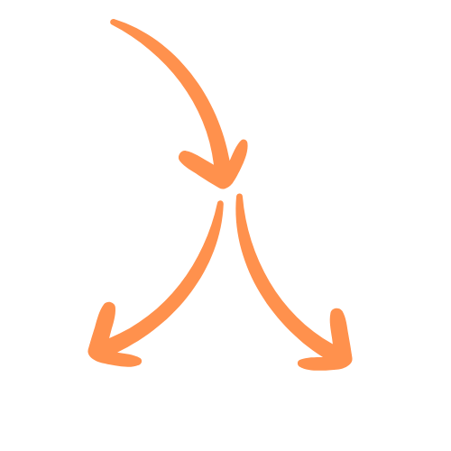

<div style="display: flex; align-items: center;">
  
  <h1>Langroid: Harness LLMs with Multi-Agent Programming</h1>
</div>

<div align="center">

[](https://github.com/langroid/langroid/actions/workflows/pytest.yml)
[](https://github.com/langroid/langroid/actions/workflows/validate.yml)
[](https://github.com/langroid/langroid/actions/workflows/mkdocs-deploy.yml)
[](https://langroid.github.io/langroid)
[](https://discord.gg/g3nAXCbZ)

</div>

Langroid is an intuitive, lightweight, transparent, flexible, extensible and principled
Python framework to build LLM-powered applications using Multi-Agent Programming. 
We welcome [contributions](CONTRIBUTING.md)!

Langroid is the first Python LLM-application framework that was explicitly
designed  with Agents as first-class citizens, and Multi-Agent Programming
as the core  design principle. The framework is inspired by ideas from the
[Actor Framework](https://en.wikipedia.org/wiki/Actor_model).
For more details see [here](https://langroid.github.io/langroid/).

Documentation: https://langroid.github.io/langroid/

Usage examples: https://github.com/langroid/langroid-examples

Community: Join us on [Discord!](https://discord.gg/g3nAXCbZ)

## :rocket: Demo

A `LeaseExtractor` agent is tasked with extracting structured information
from a commercial lease document. It generates questions that are 
answerred by a `DocAgent` using Retrieval from a vector-database
(into which the lease has been sharded + embedded).
When it has all the information it needs, the `LeaseExtractor` agent
presents the information in a structured format using a Tool/Function-calling.


## :zap: Highlights

Highlights of Langroid's features as of July 2023:

- **Agents as first-class citizens:** The `Agent` class encapsulates LLM conversation state,
  and optionally a vector-store and tools. Agents are a core abstraction in Langroid;
  Agents act as _message transformers_, and by default provide 3 _responder_ methods, one corresponding to each entity: LLM, Agent, User.
- **Tasks:** A Task class wraps an Agent, and gives the agent instructions (or roles, or goals), 
  manages iteration over an Agent's responder methods, 
  and orchestrates multi-agent interactions via hierarchical, recursive
  task-delegation. The `Task.run()` method has the same 
  type-signature as an Agent's responder's methods, and this is key to how 
  a task of an agent can delegate to other sub-tasks: from the point of view of a Task,
  sub-tasks are simply additional responders, to be used in a round-robin fashion 
  after the agent's own responders.
- **Modularity, Reusabilily, Loose coupling:** The `Agent` and `Task` abstractions allow users to design
  Agents with specific skills, wrap them in Tasks, and combine tasks in a flexible way.
- **LLM Support**: Langroid supports OpenAI LLMs including GPT-3.5-Turbo,
  GPT-4-0613
- **Caching of LLM prompts, responses:** Langroid uses [Redis](https://redis.com/try-free/) for caching.
- **Vector-stores**: [Qdrant](https://qdrant.tech/) and [Chroma](https://www.trychroma.com/) are currently supported.
  Vector stores allow for Retrieval-Augmented-Generation (RAG).
- **Grounding and source-citation:** Access to external documents via vector-stores 
   allows for grounding and source-citation.
- **Observability, Logging, Lineage:** Langroid generates detailed logs of multi-agent interactions and
  maintains provenance/lineage of messages, so that you can trace back
  the origin of a message.
- **Tools/Plugins/Function-calling**: Langroid supports OpenAI's recently
  released [function calling](https://platform.openai.com/docs/guides/gpt/function-calling)
  feature. In addition, Langroid has its own native equivalent, which we
  call **tools** (also known as "plugins" in other contexts). Function
  calling and tools have the same developer-facing interface, implemented
  using [Pydantic](https://docs.pydantic.dev/latest/),
  which makes it very easy to define tools/functions and enable agents
  to use them. Benefits of using Pydantic are that you never have to write
  complex JSON specs for function calling, and when the LLM
  hallucinates malformed JSON, the Pydantic error message is sent back to
  the LLM so it can fix it!

--- 

# :gear: Installation and Setup

## Install `langroid` 
Use `pip` to install `langroid` (from PyPi) to your virtual environment:
```bash
pip install langroid
```
The core Langroid package lets you use OpenAI Embeddings models via their API. 
If you instead want to use the `all-MiniLM-L6-v2` embeddings model
from from HuggingFace, install Langroid like this:
```bash
pip install langroid[hf-embeddings]
```
Note that this will install `torch` and `sentence-transfoemers` libraries.

## Set up environment variables (API keys, etc)

Copy the `.env-template` file to a new file `.env` and 
insert these secrets:
- **OpenAI API** key (required): If you don't have one, see [this OpenAI Page](https://help.openai.com/en/collections/3675940-getting-started-with-openai-api).
- **Qdrant** Vector Store API Key (required for apps that need retrieval from
  documents): Sign up for a free 1GB account at [Qdrant cloud](https://cloud.qdrant.io).
  Alternatively [Chroma](https://docs.trychroma.com/) is also currently supported. 
  We use the local-storage version of Chroma, so there is no need for an API key.
- **GitHub** Personal Access Token (required for apps that need to analyze git
  repos; token-based API calls are less rate-limited). See this
  [GitHub page](https://docs.github.com/en/authentication/keeping-your-account-and-data-secure/managing-your-personal-access-tokens).
- **Redis** Password (optional, only needed to cache LLM API responses):
  Redis [offers](https://redis.com/try-free/) a free 30MB Redis account
  which is more than sufficient to try out Langroid and even beyond.
  
```bash
cp .env-template .env
# now edit the .env file, insert your secrets as above
``` 
Your `.env` file should look like this:
```bash
OPENAI_API_KEY=<your key>
GITHUB_ACCESS_TOKEN=<your token>
REDIS_PASSWORD=<your password>
QDRANT_API_KEY=<your key>
```

Currently only OpenAI models are supported. Others will be added later
(Pull Requests welcome!).

---

# :tada: Usage Examples

These are quick teasers to give a glimpse of what you can do with Langroid
and how your code would look. 

:warning: The code snippets below are intended to give a flavor of the code
and they are **not** complete runnable examples! For that we encourage you to 
consult the [`langroid-examples`](https://github.com/langroid/langroid-examples) 
repository.

Also see the
[`Getting Started Guide`](https://langroid.github.io/langroid/quick-start/)
for a detailed tutorial. 

- [Direct chat with LLM](#direct-llm)
- [Simple Agent and Task](#agent-task)
- [Three Communicating Agents](#three-agents)
- [Agent with Tool/Function-calling](#agent-tool)
- [Extract Structured Info with Tool/Function-calling](#agent-tool-structured)
- [Retrieval-Augmented-Generation: Chat with Docs](#agent-rag)

---

## Direct interaction with OpenAI LLM <a name="direct-llm"></a>

```python
from langroid.language_models.openai_gpt import ( 
        OpenAIGPTConfig, OpenAIChatModel, OpenAIGPT,
)
from langroid.language_models.base import LLMMessage, Role

cfg = OpenAIGPTConfig(chat_model=OpenAIChatModel.GPT4)

mdl = OpenAIGPT(cfg)

messages = [
  LLMMessage(content="You are a helpful assistant",  role=Role.SYSTEM), 
  LLMMessage(content="What is the capital of Ontario?",  role=Role.USER),
]
response = mdl.chat(messages, max_tokens=200)
print(response.message)
```

---

## Define an agent, set up a task, and run it <a name="agent-task"></a>

```python
from langroid.agent.chat_agent import ChatAgent, ChatAgentConfig
from langroid.agent.task import Task
from langroid.language_models.openai_gpt import OpenAIChatModel, OpenAIGPTConfig

config = ChatAgentConfig(
    llm = OpenAIGPTConfig(
        chat_model=OpenAIChatModel.GPT4,
    ),
    vecdb=None, # no vector store
)
agent = ChatAgent(config)
# get response from agent's LLM, and put this in an interactive loop...
# answer = agent.llm_response("What is the capital of Ontario?")
  # ... OR instead, set up a task (which has a built-in loop) and run it
task = Task(agent, name="Bot") 
task.run() # ... a loop seeking response from LLM or User at each turn
```

---

## Three communicating agents <a name="three-agents"></a>

A toy numbers game, where when given a number `n`:
- `repeater_agent`'s LLM simply returns `n`,
- `even_agent`'s LLM returns `n/2` if `n` is even, else says "DO-NOT-KNOW"
- `odd_agent`'s LLM returns `3*n+1` if `n` is odd, else says "DO-NOT-KNOW"

First define the 3 agents, and set up their tasks with instructions:

```python
from langroid.utils.constants import NO_ANSWER
from langroid.agent.chat_agent import ChatAgent, ChatAgentConfig
from langroid.agent.task import Task
from langroid.language_models.openai_gpt import OpenAIChatModel, OpenAIGPTConfig
config = ChatAgentConfig(
    llm = OpenAIGPTConfig(
        chat_model=OpenAIChatModel.GPT4,
    ),
    vecdb = None,
)
repeater_agent = ChatAgent(config)
repeater_task = Task(
    repeater_agent,
    name = "Repeater",
    system_message="""
    Your job is to repeat whatever number you receive.
    """,
    llm_delegate=True, # LLM takes charge of task
    single_round=False, 
)
even_agent = ChatAgent(config)
even_task = Task(
    even_agent,
    name = "EvenHandler",
    system_message=f"""
    You will be given a number. 
    If it is even, divide by 2 and say the result, nothing else.
    If it is odd, say {NO_ANSWER}
    """,
    single_round=True,  # task done after 1 step() with valid response
)

odd_agent = ChatAgent(config)
odd_task = Task(
    odd_agent,
    name = "OddHandler",
    system_message=f"""
    You will be given a number n. 
    If it is odd, return (n*3+1), say nothing else. 
    If it is even, say {NO_ANSWER}
    """,
    single_round=True,  # task done after 1 step() with valid response
)
```
Then add the `even_task` and `odd_task` as sub-tasks of `repeater_task`, 
and run the `repeater_task`, kicking it off with a number as input:
```python
repeater_task.add_sub_task([even_task, odd_task])
repeater_task.run("3")
```
---

## Simple Tool/Function-calling example <a name="agent-tool"></a>

Langroid leverages Pydantic to support OpenAI's
[Function-calling API](https://platform.openai.com/docs/guides/gpt/function-calling)
as well as its own native tools. The benefits are that you don't have to write
any JSON to specify the schema, and also if the LLM hallucinates a malformed
tool syntax, Langroid sends the Pydantic validation error (suitiably sanitized) 
to the LLM so it can fix it!

Simple example: Say the agent has a secret list of numbers, 
and we want the LLM to find the smallest number in the list. 
We want to give the LLM a `probe` tool/function which takes a
single number `n` as argument. The tool handler method in the agent
returns how many numbers in its list are at most `n`.

First define the tool using Langroid's `ToolMessage` class:


```python
from langroid.agent.tool_message import ToolMessage
class ProbeTool(ToolMessage):
  request: str = "probe" # specifies which agent method handles this tool
  purpose: str = """
        To find how many numbers in my list are less than or equal to  
        the <number> you specify.
        """ # description used to instruct the LLM on when/how to use the tool
  number: int  # required argument to the tool
```

Then define a `SpyGameAgent` as a subclass of `ChatAgent`, 
with a method `probe` that handles this tool:

```python
from langroid.agent.chat_agent import ChatAgent, ChatAgentConfig
class SpyGameAgent(ChatAgent):
  def __init__(self, config: ChatAgentConfig):
    super().__init__(config)
    self.numbers = [3, 4, 8, 11, 15, 25, 40, 80, 90]

  def probe(self, msg: ProbeTool) -> str:
    # return how many numbers in self.numbers are less or equal to msg.number
    return str(len([n for n in self.numbers if n <= msg.number]))
```

We then instantiate the agent and enable it to use and respond to the tool:

```python
from langroid.language_models.openai_gpt import OpenAIChatModel, OpenAIGPTConfig
spy_game_agent = SpyGameAgent(
    ChatAgentConfig(
        name="Spy",
        llm = OpenAIGPTConfig(
            chat_model=OpenAIChatModel.GPT4,
        ),
        vecdb=None,
        use_tools=False, #  don't use Langroid native tool
        use_functions_api=True, # use OpenAI function-call API
    )
)
spy_game_agent.enable_message(ProbeTool)
```

For a full working example see the
[chat-agent-tool.py](https://github.com/langroid/langroid-examples/blob/main/examples/quick-start/chat-agent-tool.py)
script in the `langroid-examples` repo.

---

## Tool/Function-calling to extract structured information from text <a name="agent-tool-structured"></a>

Suppose you want an agent to extract 
the key terms of a lease, from a lease document, as a nested JSON structure.
First define the desired structure via Pydantic models:

```python
from pydantic import BaseModel
class LeasePeriod(BaseModel):
    start_date: str
    end_date: str


class LeaseFinancials(BaseModel):
    monthly_rent: str
    deposit: str

class Lease(BaseModel):
    period: LeasePeriod
    financials: LeaseFinancials
    address: str
```

Then define the `LeaseMessage` tool as a subclass of Langroid's `ToolMessage`.
Note the tool has a required argument `terms` of type `Lease`:

```python
class LeaseMessage(ToolMessage):
    request: str = "lease_info"
    purpose: str = """
        Collect information about a Commercial Lease.
        """
    terms: Lease
```

Then define a `LeaseExtractorAgent` with a method `lease_info` that handles this tool,
instantiate the agent, and enable it to use and respond to this tool:

```python
class LeaseExtractorAgent(ChatAgent):
    def lease_info(self, message: LeaseMessage) -> str:
        print(
            f"""
        DONE! Successfully extracted Lease Info:
        {message.terms}
        """
        )
        return json.dumps(message.terms.dict())
    
lease_extractor_agent = LeaseExtractorAgent(
  ChatAgentConfig(
    llm=OpenAIGPTConfig(),
    use_functions_api=False,
    use_tools=True,
  )
)
lease_extractor_agent.enable_message(LeaseMessage)
```

See the [`chat_multi_extract.py`](https://github.com/langroid/langroid-examples/blob/main/examples/docqa/chat_multi_extract.py)
script in the `langroid-examples` repo for a full working example.

---

## Chat with documents (file paths, URLs, etc) <a name="agent-docs"></a>

Langroid provides a specialized agent class `DocChatAgent` for this purpose.
It incorporates document sharding, embedding, storage in a vector-DB, 
and retrieval-augmented query-answer generation.
Using this class to chat with a collection of documents is easy.
First create a `DocChatAgentConfig` instance, with a 
`doc_paths` field that specifies the documents to chat with.

```python
from langroid.agent.doc_chat_agent import DocChatAgentConfig
config = DocChatAgentConfig(
  doc_paths = [
    "https://en.wikipedia.org/wiki/Language_model",
    "https://en.wikipedia.org/wiki/N-gram_language_model",
    "/path/to/my/notes-on-language-models.txt",
  ]
  llm = OpenAIGPTConfig(
    chat_model=OpenAIChatModel.GPT4,
  ),
  vecdb=VectorStoreConfig(
    type="qdrant",
  ),
)
```

Then instantiate the `DocChatAgent`, ingest the docs into the vector-store:

```python
agent = DocChatAgent(config)
agent.ingest()
```
Then we can either ask the agent one-off questions,
```python
agent.chat("What is a language model?")
```
or wrap it in a `Task` and run an interactive loop with the user:
```python
from langroid.task import Task
task = Task(agent)
task.run()
```

See full working scripts in the 
[`docqa`](https://github.com/langroid/langroid-examples/tree/main/examples/docqa)
folder of the `langroid-examples` repo.

---

# Contributors

- Prasad Chalasani (IIT BTech/CS, CMU PhD/ML; Independent ML Consultant)
- Somesh Jha (IIT BTech/CS, CMU PhD/CS; Professor of CS, U Wisc at Madison)
- Mohannad Alhanahnah (Research Associate, U Wisc at Madison)
- Ashish Hooda (IIT BTech/CS; PhD Candidate, U Wisc at Madison)

