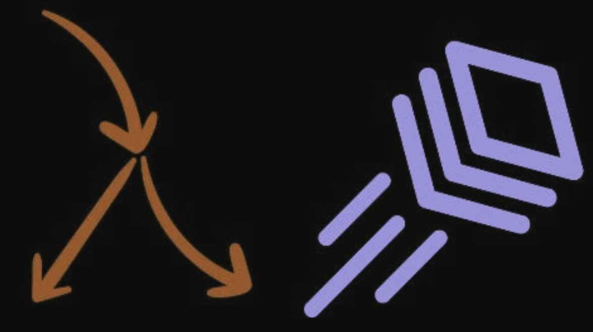

## Langroid: Multi-Agent Programming framework for LLMs

In this era of Large Language Models (LLMs), there is unprecedented demand to
create intelligent applications powered by this transformative technology. What
is the best way for developers to harness the potential of LLMs in complex
application scenarios? For a variety of technical and practical reasons (context
length limitations, LLM brittleness, latency, token-costs), this is not as
simple as throwing a task at an LLM system and expecting it to get done. What is
needed is a principled programming framework, offering the right set of
abstractions and primitives to make developers productive when building LLM
applications.
<!-- more -->
## Langroid's Elegant Multi-Agent Paradigm

The [Langroid](https://github.com/langroid/langroid) team (ex-CMU/UW-Madison researchers) 
has a unique take on this – they have built an open source Python framework to 
simplify LLM application development, using a Multi-Agent Programming paradigm. 
Langroid’s architecture is founded on Agents as first-class citizens: 
they are message-transformers, and accomplish tasks collaboratively via messages.

Langroid is emerging as a popular LLM framework; developers appreciate its clean
design and intuitive, extensible architecture. Programming with Langroid is
natural and even fun: you configure Agents and equip them with capabilities (
such as LLMs, vector-databases, Function-calling/tools), connect them and have
them collaborate via messages. This is a “Conversational Programming” paradigm,
and works with local/open and remote/proprietary LLMs. (Importantly, it does not
use LangChain or any other existing LLM framework).

<figure markdown>
  { width="800" }
  <figcaption>
An Agent serves as a convenient abstraction, encapsulating the state of LLM
conversations, access to vector stores, and various tools (functions or
plugins). A Multi-Agent Programming framework naturally aligns with the demands
of complex LLM-based applications.
</figcaption>
</figure>


## Connecting Agents via Tasks

In Langroid, a ChatAgent has a set of “responder” methods, one for each "entity":
an LLM, a human, and a tool-handler. However it does not have any way to iterate through
these responders. This is where the Task class comes in: A Task wraps an Agent
and gives it the ability to loop through its responders, via the `Task.run()` method. 

A Task loop is organized around simple rules that govern when a responder is eligible
to respond, what is considered a valid response, and when the task is complete.
The simplest example of a Task loop is an interactive chat with the human user. 
A Task also enables an Agent to interact with other agents: 
other tasks can be added to a task as sub-tasks, 
in a recursive, hierarchical (or DAG) structure. From a Task’s perspective,
sub-tasks are just additional responders, and present the same string-to-string 
message-transformation interface (function signature) as the Agent’s "native" responders. 
This is the key to composability of tasks in Langroid,
since a sub-task can act the same way as an Agent's "native" responders, and is subject
to the same rules of task orchestration. The result is that the same task orchestration
mechanism seamlessly enables tool handling, retries when LLM deviates, and 
delegation to sub-tasks. More details are in the Langroid [quick-start guide](https://langroid.github.io/langroid/quick-start/)

## A Taste of Coding with Langroid

To get started with Langroid, simply install it from pypi into your virtual environment:

```bash
pip install langroid
```
To directly chat with an OpenAI LLM, define the LLM configuration,
instantiate a language model object and interact with it:
(Langroid works with non-OpenAI local/propreitary LLMs as well,
see their [tutorial](https://langroid.github.io/langroid/tutorials/non-openai-llms/)) 
For the examples below, ensure you have a file `.env` containing your OpenAI API key
with this line: `OPENAI_API_KEY=sk-...`.
    
```python
import langroid as lr
import langroid.language_models as lm

llm_cfg = lm.OpenAIGPTConfig() # default GPT4-Turbo
mdl = lm.OpenAIGPT(llm_cfg)
mdl.chat("What is 3+4?", max_tokens=10)
```
The mdl does not maintain any conversation state; for that you need a `ChatAgent`:

```python
agent_cfg = lr.ChatAgentConfig(llm=llm_cfg)
agent = lr.ChatAgent(agent_cfg)
agent.llm_response("What is the capital of China?")
agent.llm_response("What about France?") # interprets based on previous msg
```
Wrap a ChatAgent in a Task to create a basic interactive loop with the user:

```python
task = lr.Task(agent, name="Bot")
task.run("Hello")
```
Have a Teacher Agent talk to a Student Agent:
    
```python
teacher = lr.ChatAgent(agent_cfg)
teacher_task = lr.Task(
    teacher, name="Teacher",
    system_message="""
        Ask your student simple number-based questions, and give feedback.
        Start with a question.
        """,
)
student = lr.ChatAgent(agent_cfg)
student_task = lr.Task(
    student, name="Student",
    system_message="Concisely answer your teacher's questions."
)
teacher_task.add_sub_task(student_task)
teacher_task.run()
```


## Retrieval Augmented Generation (RAG) and Vector Databases

One of the most popular LLM applications is question-answering 
on documents via Retrieval-Augmented Generation (RAG), powered by a vector database.
Langroid has a built-in DocChatAgent that incorporates a number of advanced RAG techniques, 
clearly laid out so they can be easily understood and extended.

### Built-in Support for LanceDB
<figure markdown>
  { width="800" }
  <figcaption>
Langroid uses LanceDB as the default vector store for its DocChatAgent.
</figcaption>
</figure>

Langroid's DocChatAgent uses the LanceDB serverless vector-database by default.
Since LanceDB uses file storage, it is easy to set up and use (no need for docker or cloud services),
and due to its use of the Lance columnar format, it is 
highly performant and scalable. 
In addition, Langroid has a specialized `LanceDocChatAgent` that leverages LanceDB's 
unique features such as Full-text search, SQL-like filtering, and pandas dataframe interop.
Setting up a basic RAG chatbot is as simple as (assume the previous imports):

```python
from langroid.agent.special.lance_doc_chat_agent import import (
    LanceDocChatAgent, DocChatAgentConfig
)
llm_config = lm.OpenAIGPTConfig()

rag_agent_config = DocChatAgentConfig(
    llm=llm_config, 
    doc_paths=["/path/to/my/docs"], # files, folders, or URLs.
)
rag_agent = LanceDocChatAgent(rag_agent_config)
rag_task = lr.Task(rag_agent, name="RAG")
rag_task.run()
```

For an example showcasing Tools/Function-calling + RAG in a multi-agent setup, see their quick-start
[Colab notebook](https://colab.research.google.com/github/langroid/langroid/blob/main/examples/Langroid_quick_start.ipynb)
which shows a 2-agent system where one agent is tasked with extracting structured information
from a document, and generates questions for the other agent to answer using RAG.
In the Langroid-examples repo there is a [script](https://github.com/langroid/langroid-examples/blob/main/examples/docqa/chat_multi_extract.py) with the same functionality,
and here is what it looks like in action:


<figure markdown>
  { width="800" }
  <figcaption>
Extracting structured info from a Commercial Lease using a 2-agent system, with 
a Tool/Function-calling and RAG. The Extractor Agent is told to extract information
in a certain structure, and it generates questions for the Document Agent
to answer using RAG.
</figcaption>
</figure>

## Retrieval Augmented Analytics

One of the unique features of LanceDB is its SQL-like filtering and Pandas dataframe interoperability.
LLMs are great at generating SQL queries, and also Pandas computation code such as `df.groupby("col").mean()`.
This opens up a very interesting possibility, which we call
**Retrieval Augmented Analytics:** Suppose a user has a large dataset of movie descriptions
with metadata such as rating, year and genre, and wants to ask:

> What is the highest-rated Comedy movie about college students made after 2010?

It is not hard to imagine that an LLM should be able to generate a **Query Plan** to answer this,
consisting of:

- A SQL-like filter: `genre = "Comedy" and year > 2010`
- A Pandas computation: `df.loc[df["rating"].idxmax()]`
- A rephrased query given the filter: "Movie about college students" (used for semantic/lexical search)

Langroid's Multi-Agent framework enables exactly this type of application. 
The [`LanceRAGTaskCreator`](https://github.com/langroid/langroid/blob/main/langroid/agent/special/lance_rag/lance_rag_task.py) takes a `LanceDocChatAgent` and adds two additional agents:

- QueryPlannerAgent: Generates the Query Plan
- QueryPlanCriticAgent: Critiques the Query Plan and Answer received from the RAG Agent, so that 
  the QueryPlanner can generate a better plan if needed.

Checkout the [`lance-rag-movies.py`](https://github.com/langroid/langroid-examples/blob/main/examples/docqa/lance-rag-movies.py) script in the langroid-examples repo to try this out.

## Try it out and get involved!
This was just a glimpse of what you can do with Langroid and how your code would look.
Give it a shot and learn more about the features and roadmap of Langroid on their 
[GitHub repo](https://github.com/langroid/langroid). Langroid welcomes contributions,
and they have a friendly [Discord](https://discord.gg/ZU36McDgDs) community.

If you like it, don’t forget to drop a 🌟.


