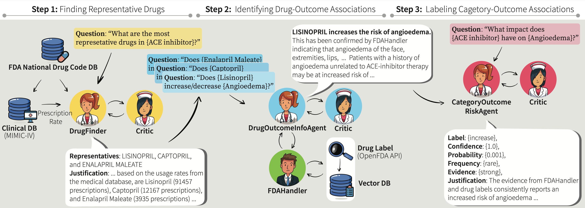
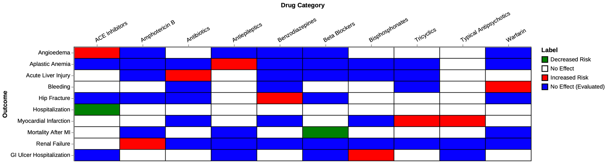
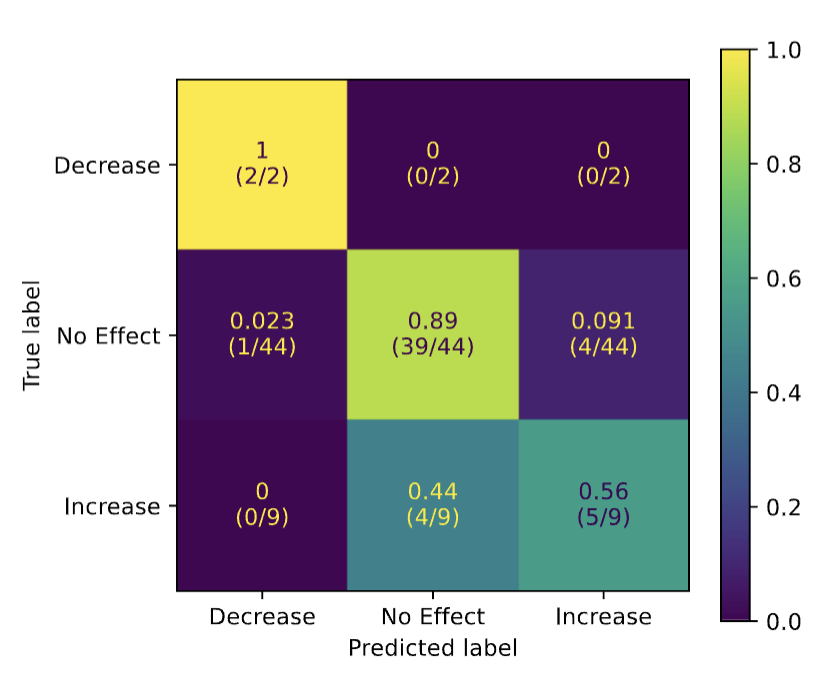

# MALADE: Multi-Agent Architecture for Pharmacovigilance

[Published in ML for HealthCare 2024](https://www.mlforhc.org/2024-abstracts)

[Arxiv](https://arxiv.org/abs/2408.01869) 

[GitHub](https://github.com/jihyechoi77/malade)

## Summary
We introduce MALADE (**M**ultiple **A**gents powered by **L**LMs for **ADE** Extraction),
a multi-agent system for Pharmacovigilance. It is the first effective explainable 
multi-agent LLM system for extracting Adverse Drug Events (ADEs) from FDA drug labels and drug prescription data.
<!-- more -->
Given a drug category and an adverse outcome, MALADE
produces:

- a qualitative label of risk (`increase`, `decrease` or `no-effect`),
- confidence in the label (a number in $[0,1]$),
- frequency of effect (`rare`, `common`, or `none`),
- strength of evidence (`none`, `weak`, or `strong`), and
- a justification with citations.

This task is challenging for several reasons: 

- FDA labels and prescriptions are for individual drugs, not drug categories, so representative drugs in a category 
  need to be identified from patient prescription data, and ADE information found for specific drugs in a category 
  needs to be aggregated to make a statement about the category as a whole, 
- The data is noisy, with variations in the terminologies of drugs and outcomes, and 
- ADE descriptions are often buried in large amounts of narrative text.

The MALADE architecture is LLM-agnostic 
and leverages the [Langroid](https://github.com/langroid/langroid) multi-agent framework.
It consists of a combination of Agents using Retrieval Augmented Generation (RAG), that 
iteratively improve their answers based on feedback from Critic Agents.
We evaluate the quantitative scores against 
a ground-truth dataset known as the [*OMOP Ground Truth Task*](https://www.niss.org/sites/default/files/Session3-DaveMadigan_PatrickRyanTalk_mar2015.pdf)
and find that MALADE achieves state-of-the-art performance.

## Introduction

In the era of Large Language Models (LLMs), given their remarkable text understanding and generation abilities, 
there is an unprecedented opportunity to develop new, LLM-based methods for trustworthy medical knowledge synthesis, 
extraction and summarization. The focus of this paper is Pharmacovigilance, a critical task in healthcare, where 
the goal is to monitor and evaluate the safety of drugs. In particular, the identification of Adverse Drug Events 
(ADEs) is crucial for ensuring patient safety. Consider a question such as this:

> What is the effect of **ACE inhibitors** on the risk of developing **angioedema**?

Here the **drug category** $C$ is _ACE inhibitors_, and the **outcome** $O$ is _angioedema_.
Answering this question involves several steps:

- **1(a): Find all drugs** in the ACE inhibitor category $C$, e.g. by searching the FDA 
[National Drug Code](https://www.fda.gov/drugs/drug-approvals-and-databases/national-drug-code-directory) (NDC) 
   database. This can be done using Elastic-Search, with filters to handle variations in drug/category names and inaccurate classifications.
- **1(b): Find the prescription frequency** of each drug in $C$ from patient prescription data, e.g. 
the [MIMIC-IV](https://physionet.org/content/mimiciv/3.0/) database. This can be done with a SQL query.
- **1(c): Identify the representative drugs** $D \subset C$ in this category, based on prescription frequency data 
     from step 2.  
- **2:** For each drug $d \in D$, **summarize ADE information** about the effect of $d$ on the outcome $O$ of interest,
   (in this case angioedema) from text-based pharmaceutical sources, 
    e.g. the [OpenFDA Drug Label](https://open.fda.gov/apis/drug/label/) database.
- **3: Aggregate** the information from all drugs in $D$ to make a statement about the category $C$ as a whole.

## The role of LLMs

While steps 1(a) and 1(b) can be done by straightforward deterministic algorithms (SQL queries or Elastic-Search), the 
remaining steps are challenging but ideally suited to LLMs:

### Step 1(c): Identifying representative drugs in a category from prescription frequency data (`DrugFinder` Agent)

This is complicated by noise, such as the same drug appearing multiple times under different names, 
formulations or delivery methods (For example, the ACE inhibitor **Lisinopril** is also known as **Zestril** and **Prinivil**.) 
  Thus a judgment must
  be made as to whether these are sufficiently different to be considered pharmacologically distinct;
  and some of these drugs may not actually belong to the category. This task thus requires a grouping operation, 
  related to the task of identifying standardized drug codes from text descriptions,
  well known to be challenging. This makes it very difficult to explicitly define the algorithm in a deterministic 
  manner that covers all edge cases (unlike the above database tasks), and hence is well-suited
  to LLMs, particularly those such as GPT-4, Claude3.5, and similar-strength variants which are known to have been 
  trained on vast amounts of general medical texts. 

In MALADE, this task is handled by the `DrugFinder` agent,
which is an Agent/Critic system where the main agent iteratively improves its output
in a feedback loop with the Critic agent. For example, the Critic corrects the Agent when it incorrectly
classifies drugs as pharmacologically distinct.

###  Step 2: Identifying Drug-Outcome Associations (`DrugOutcomeInfoAgent`)

The task here is to identify whether a given drug
has an established effect on the risk of a given outcome, based on FDA drug label database, and
output a summary of relevant information, including the level of identified risk and the evidence for
such an effect. Since this task involves extracting information from narrative text, it is well-suited to
LLMs using the Retrieval Augmented Generation (RAG) technique. 

In MALADE, the `DrugOutcomeInfoAgent` handles this task, and is also an Agent/Critic system, where the Critic
provides feedback and corrections to the Agent's output.
This agent does not have direct access to the FDA Drug Label data, but can receive
this information via another agent, `FDAHandler`. FDAHandler is equipped with **tools** (also known as function-calls) 
to invoke the OpenFDA API for drug label data, and answers questions in the context of information retrieved
based on the queries. Information received from this API is ingested into a vector database, so the
agent first uses a tool to query this vector database, and only resorts to the OpenFDA API tool if
the vector database does not contain the relevant information. An important aspect of this agent is that
its responses include specific **citations** and **excerpts** justifying its conclusions.

###  Step 3: Labeling Drug Category-Outcome Associations (`CategoryOutcomeRiskAgent`)

To identify association between a drug category C and an adverse health outcome $O$, we concurrently run a batch of 
queries to copies of `DrugOutcomeInfoAgent`, one for each drug $d$ in the
representative-list $D$ for the category, of the form: 

> Does drug $d$ increase or decrease the risk of condition $O$?

The results are sent to `CategoryOutcomeRiskAgent`, 
which is an Agent/Critic system which performs the final classification
step; its goal is to generate the qualitative and quantitative outputs mentioned above.

## MALADE Architecture

The figure below illustrates how the MALADE architecture handles the query,

> What is the effect of **ACE inhibitors** on the risk of developing **angioedema**?

The query triggers a sequence of subtasks performed by the three Agents described above: 
`DrugFinder`, `DrugOutcomeInfoAgent`, and `CategoryOutcomeRiskAgent`.
Each Agent generates a response and justification, which are validated by a corresponding Critic agent, whose feedback is
used by the Agent to revise its response.

## Evaluation

### OMOP Ground Truth

We evaluate the results of MALADE against a well-established ground-truth dataset, 
the [OMOP ADE ground-truth table](https://www.niss.org/sites/default/files/Session3-DaveMadigan_PatrickRyanTalk_mar2015.pdf), shown below.
This is a reference dataset within the Observational Medical Outcomes Partnership (OMOP) Common Data Model that 
contains validated information about known adverse drug events.

### Confusion Matrix

Below is a side-by-side comparison of this ground-truth dataset (left) with MALADE's labels (right), ignoring blue 
cells (see the paper for details):

The resulting confusion-matrix for MALADE is shown below:

### AUC Metric

Since MALADE produces qualitative and quantitative outputs, the paper explores a variety of ways to evaluate its
performance against the OMOP ground-truth dataset. Here we focus on the label output $L$ (i.e. `increase`, 
`decrease`, or `no-effect`), and its associated confidence score $c$, and use the Area Under the ROC Curve (AUC) as 
the evaluation metric.
The AUC metric is designed for binary classification, so we transform the three-class label output $L$ and
confidence score $c$ to a binary classification score $p$ as follows.
We treat $L$ = `increase` as the positive class,
and $L$ = `decrease` or `no-effect` as the negative class, and
we transform the label confidence score $c$ into a probability $p$ of `increase` as follows:

- if the label output is `increase`, $p = (2+c)/3$,
- if the label output is `no-effect`, $p = (2-c)/3$, and
- if the label output is `decrease` , $p = (1-c)/3$.

These transformations align with two intuitions: (a) a *higher* confidence in `increase` corresponds
to a *higher* probability of `increase`, and a *higher* confidence in `no-effect` or `decrease`
corresponds to a *lower* probability of `increase`, and (b) for a given confidence score $c$, the progression
of labels `decrease`, `no-effect`, and `increase` corresponds to *increasing* probabilities of `increase`.
The above transformations ensure that the probability $p$ is in the range $[0,1]$ and scales linearly with the
confidence score $c$.

We ran the full MALADE system for all drug-category/outcome pairs in the OMOP ground-truth dataset, 
and then computed the AUC for the score $p$ against the ground-truth binary classification label.
With `GPT-4-Turbo` we obtained an AUC of 0.85, while `GPT-4o` resulted in an AUC of 0.90.
These are state-of-the-art results for this specific ADE-extraction task.

### Ablations

An important question the paper investigates is whether (and how much) the various components (RAG, critic agents, etc)
contribute to MALADE's performance. To answer this, we perform ablations, where we remove one or more
components from the MALADE system and evaluate the performance of the resulting system.
For example we found that dropping the Critic agents reduces the AUC (using `GPT-4-Turbo`) from 0.85 to 0.82
(see paper, Appendix D for more ablation results).

### Variance of LLM-generated Scores

When using an LLM to generate numerical scores, it is important to understand the variance in the scores.
For example, if a single "full" run of MALADE (i.e. for all drug-category/outcome pairs in the OMOP ground-truth
dataset) produces a certain AUC, was it a "lucky" run, or is the AUC relatively stable across runs?
Ideally one would investigate this by repeating the full run of MALADE many times,  
but given the expense of running a full experiment, we focus on just three representative cells in the OMOP table,
one corresponding to each possible ground-truth label, and run MALADE 10 times for each cells, and
study the distribution of $p$ (the probability of increased risk, translated from the confidence score using the
method described above), for each output label. Encouragingly, we find that the distribution of $p$ shows clear
separation between the three labels, as in the figure below (The $x$ axis ranges from 0 to 1, and the three colored
groups of bars represent, from left to right, `decrease`, `no-effect`, and `increase` labels). Full details are in 
the Appendix D of the paper.

