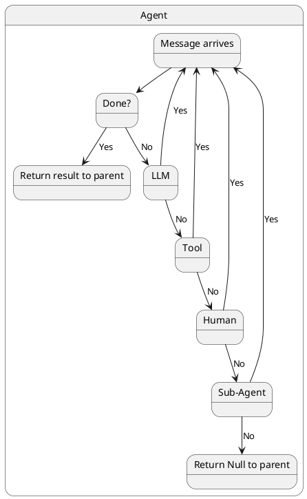
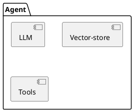
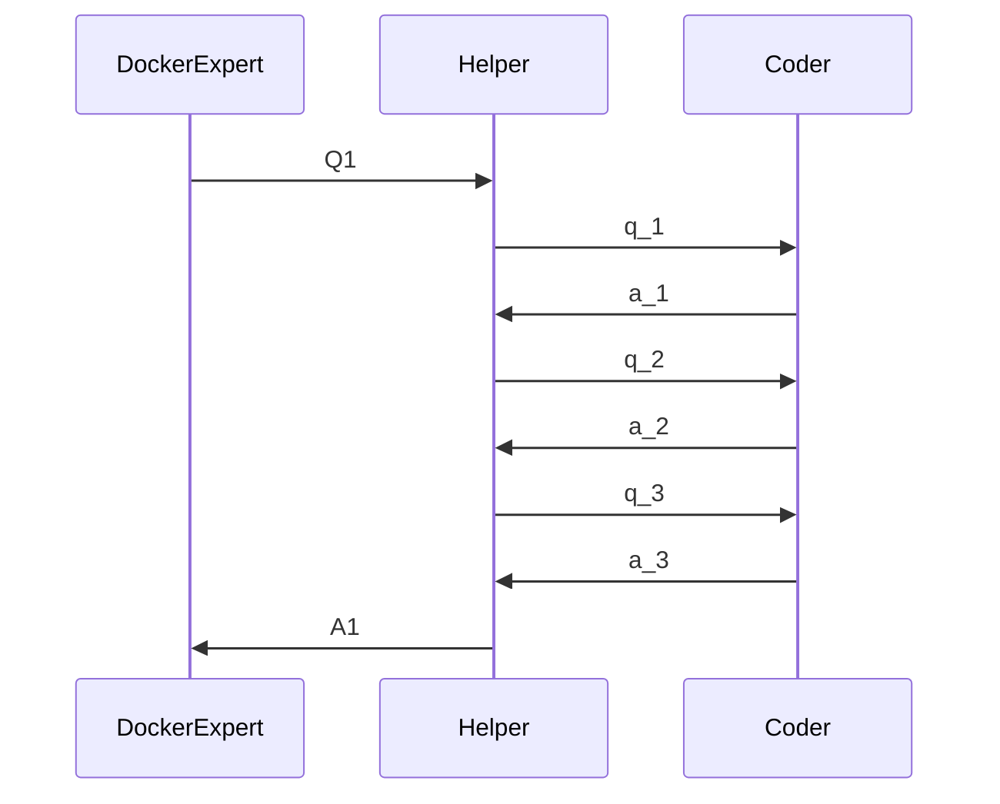
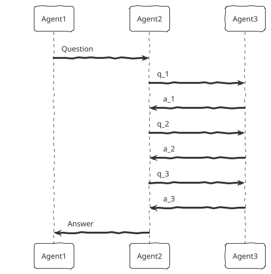
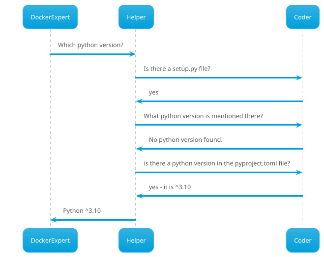

# PlantUML Diagram for Agent Message Handling Cascade



# Mermaid diagram for Agent message handling

```mermaid
graph LR
    subgraph Agent Message Handling Cascade, Delegating to Agent-1
        MSG[Message] --> Done{Done?}
        Done -- No --> LLM{LLM}
        Done -- Yes --> ReturnDone[Return result to Parent Task]
        LLM -- No --> TOOL{Tool}
        LLM -- Yes --> MSG
        TOOL -- No --> HUMAN{Human}
        TOOL -- Yes --> MSG
        HUMAN -- No --> AGENT{Agent-1 Task}
        HUMAN -- Yes --> MSG
        AGENT -- No --> Return[Return Null to parent Task]
        AGENT -- Yes --> MSG
    end

```

# PlantUML for Agent Structure



# Docker Expert 3-agent communication: nested delegation






