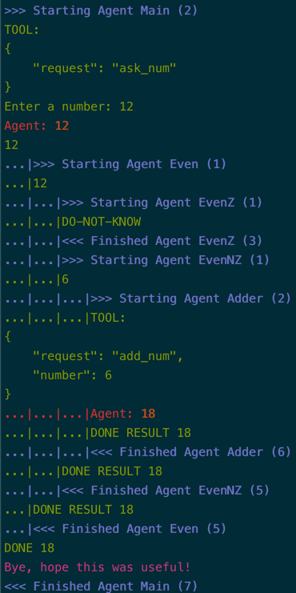

# Hierarchical computation with Langroid Agents 

Here is a simple example showing tree-structured computation
where each node in the tree is handled by a separate agent.
This is a toy numerical example, and illustrates:

- how to have agents organized in a hierarchical structure to accomplish a task 
- the use of global state accessible to all agents, and 
- the use of tools/function-calling.

## The Computation 

We want to carry out the following calculation for a given input number $n$:

```python
def Main(n):
    if n is odd:
        return (3*n+1) + n
    else:
        if n is divisible by 10:
            return n/10 + n
        else:
            return n/2 + n
```

## Using function composition

Imagine we want to do this calculation using a few auxiliary functions:

```python
def Main(n):
    # return non-null value computed by Odd or Even
    Record n as global variable # to be used by Adder below
    return Odd(n) or Even(n)

def Odd(n):
    # Handle odd n
    if n is odd:
        new = 3*n+1
        return Adder(new)
    else:
        return None
    
def Even(n):
    # Handle even n: return non-null value computed by EvenZ or EvenNZ
    return EvenZ(n) or EvenNZ(n)

def EvenZ(n):
    # Handle even n divisible by 10, i.e. ending in Zero
    if n is divisible by 10:
        new = n/10
        return Adder(new)
    else:
        return None
    
def EvenNZ(n):
    # Handle even n not divisible by 10, i.e. not ending in Zero
    if n is not divisible by 10:
        new = n/2
        return Adder(new)
    else:
        return None  

def Adder(new):
    # Add new to starting number, available as global variable n
    return new + n
```

## Mapping to a tree structure

This compositional/nested computation can be represented as a tree:

```plaintext
       Main
     /     \
  Even     Odd
  /   \        \
EvenZ  EvenNZ   Adder
  |      |
 Adder  Adder
```

Let us specify the behavior we would like for each node, in a 
"decoupled" way, i.e. we don't want a node to be aware of the other nodes.
As we see later, this decoupled design maps very well onto Langroid's
multi-agent task orchestration. To completely define the node behavior,
we need to specify how it handles an "incoming" number $n$ (from a parent node 
or user), and how it handles a "result" number $r$ (from a child node).

- `Main`: 
    - incoming $n$: simply send down $n$, record the starting number $n_0 = n$ as a global variable. 
    - result $r$: return $r$.
- `Odd`: 
    - incoming $n$: if n is odd, send down $3*n+1$, else return None
    - result $r$: return $r$
- `Even`: 
    - incoming $n$: if n is even, send down $n$, else return None
    - result $r$: return $r$
- `EvenZ`: (guaranteed by the tree hierarchy, to receive an even number.)  
    - incoming $n$: if n is divisible by 10, send down $n/10$, else return None
    - result $r$: return $r$
- `EvenNZ`: (guaranteed by the tree hierarchy, to receive an even number.)
    - incoming $n$: if n is not divisible by 10, send down $n/2$, else return None
    - result $r$: return $r$
- `Adder`:
    - incoming $n$: return $n + n_0$ where $n_0$ is the 
    starting number recorded by Main as a global variable.
    - result $r$: Not applicable since `Adder` is a leaf node.
  
## From tree nodes to Langroid Agents 

Let us see how we can perform this calculation using multiple Langroid agents, where

- we define an agent corresponding to each of the nodes above, namely 
`Main`, `Odd`, `Even`, `EvenZ`, `EvenNZ`, and `Adder`.
- we wrap each Agent into a Task, and use the `Task.add_subtask()` method to connect the agents into 
  the desired hierarchical structure.

Below is one way to do this using Langroid. We designed this with the following
desirable features:

- Decoupling: Each agent is instructed separately, without mention of any other agents
  (E.g. Even agent does not know about Odd Agent, EvenZ agent, etc).
  In particular, this means agents will not be "addressing" their message
  to specific other agents, e.g. send number to Odd agent when number is odd,
  etc. Allowing addressing would make the solution easier to implement,
  but would not be a decoupled solution.
  Instead, we want Agents to simply put the number "out there", and have it handled
  by an applicable agent, in the task loop (which consists of the agent's responders,
  plus any sub-task `run` methods).

- Simplicity: Keep the agent instructions relatively simple. We would not want a solution
  where we have to instruct the agents (their LLMs) in convoluted ways. 

One way naive solutions fail is because agents are not able to distinguish between
a number that is being "sent down" the tree as input, and a number that is being
"sent up" the tree as a result from a child node.

We use a simple trick: we instruct the LLM to mark returned values using the RESULT keyword,
and instruct the LLMs on how to handle numbers that come with RESULT keyword, and those that don't
In addition, we leverage some features of Langroid's task orchestration:

- When `llm_delegate` is `True`, if the LLM says `DONE [rest of msg]`, the task is
  considered done, and the result of the task is `[rest of msg]` (i.e the part after `DONE`).
- In the task loop's `step()` function (which seeks a valid message during a turn of
  the conversation) when any responder says `DO-NOT-KNOW`, it is not considered a valid
  message, and the search continues to other responders, in round-robin fashion.


See the [`chat-tree.py`](https://github.com/langroid/langroid/blob/main/examples/basic/chat-tree.py)
example for an implementation of this solution. You can run that example as follows:
```bash
python3 examples/basic/chat-tree.py
```
In the sections below we explain the code in more detail.

## Define the agents

Let us start with defining the configuration to be used by all agents:

```python
from langroid.agent.chat_agent import ChatAgent, ChatAgentConfig
from langroid.language_models.openai_gpt import OpenAIChatModel, OpenAIGPTConfig

config = ChatAgentConfig(
  llm=OpenAIGPTConfig(
    chat_model=OpenAIChatModel.GPT4o,
  ),
  vecdb=None, # no need for a vector database
)
```

Next we define each of the agents, for example:

```python
main_agent = ChatAgent(config)
```

and similarly for the other agents.

## Wrap each Agent in a Task

To allow agent interactions, the first step is to wrap each agent in a Task.
When we define the task, we pass in the instructions above as part of the system message.
Recall the instructions for the `Main` agent:

- `Main`:
    - incoming $n$: simply send down $n$, record the starting number $n_0 = n$ as a global variable.
    - result $r$: return $r$.

We include the equivalent of these instructions in the `main_task` that wraps 
the `main_agent`:

```python
from langroid.agent.task import Task

main_task = Task(
    main_agent,
    name="Main",
    interactive=False, #(1)!
    system_message="""
          You will receive two types of messages, to which you will respond as follows:
          
          INPUT Message format: <number>
          In this case simply write the <number>, say nothing else.
          
          RESULT Message format: RESULT <number>
          In this case simply say "DONE <number>", e.g.:
          DONE 19
    
          To start off, ask the user for the initial number, 
          using the `ask_num` tool/function.
          """,
    llm_delegate=True, # allow LLM to control end of task via DONE
    single_round=False,
)
```

1. Non-interactive: don't wait for user input in each turn 

There are a couple of points to highlight about the `system_message` 
value in this task definition:

- When the `Main` agent receives just a number, it simply writes out that number,
  and in the Langroid Task loop, this number becomes the "current pending message"
  to be handled by one of the sub-tasks, i.e. `Even, Odd`. Note that these sub-tasks
  are _not_ mentioned in the system message, consistent with the decoupling principle.
- As soon as either of these sub-tasks returns a non-Null response, in the format "RESULT <number>", the `Main` agent
  is instructed to return this result saying "DONE <number>". Since `llm_delegate`
  is set to `True` (meaning the LLM can decide when the task has ended), 
  this causes the `Main` task to be considered finished and the task loop is exited.

Since we want the `Main` agent to record the initial number as a global variable,
we use a tool/function `AskNum` defined as follows 
(see [this section](../quick-start/chat-agent-tool.md) in the getting started guide 
for more details on Tools):

```python
from rich.prompt import Prompt
from langroid.agent.tool_message import ToolMessage


class AskNumTool(ToolMessage):
  request = "ask_num"
  purpose = "Ask user for the initial number"

  def handle(self) -> str:
    """
    This is a stateless tool (i.e. does not use any Agent member vars), so we can
    define the handler right here, instead of defining an `ask_num`
    method in the agent.
    """
    num = Prompt.ask("Enter a number")
    # record this in global state, so other agents can access it
    MyGlobalState.set_values(number=num)
    return str(num)
```

We then enable the `main_agent` to use and handle messages that conform to the 
`AskNum` tool spec:

```python
main_agent.enable_message(AskNumTool)
```

!!! tip "Using and Handling a tool/function"
    "Using" a tool means the agent's LLM _generates_ 
    the function-call (if using OpenAI function-calling) or 
    the JSON structure (if using Langroid's native tools mechanism) 
    corresponding to this tool. "Handling" a tool refers to the Agent's method 
    recognizing the tool and executing the corresponding code.


The tasks for other agents are defined similarly. We will only note here
that the `Adder` agent needs a special tool `AddNumTool` to be able to add the current number
to the initial number set by the `Main` agent. 

## Connect the tasks into a tree structure

So far, we have wrapped each agent in a task, in isolation, and there is no 
connection between the tasks. The final step is to connect the tasks to 
the tree structure we saw earlier:

```python
main_task.add_sub_task([even_task, odd_task])
even_task.add_sub_task([evenz_task, even_nz_task])
evenz_task.add_sub_task(adder_task)
even_nz_task.add_sub_task(adder_task)
odd_task.add_sub_task(adder_task)
```

Now all that remains is to run the main task:

```python
main_task.run()
```

Here is what a run starting with $n=12$ looks like:




