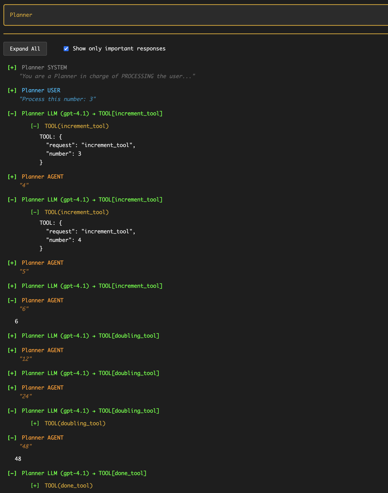

# HTML Logger

The HTML logger creates interactive, self-contained HTML files that make it easy to navigate complex multi-agent conversations in Langroid.

## Enabling the HTML Logger

The HTML logger is **enabled by default** in `TaskConfig`:

```python
import langroid as lr

# HTML logging is automatically enabled
task = lr.Task(agent)

# To disable HTML logging
task = lr.Task(agent, config=lr.TaskConfig(enable_html_logging=False))

# To change the log directory (default is "logs/")
task = lr.Task(agent, config=lr.TaskConfig(logs_dir="my_logs"))
```

## Log Files

Langroid creates three types of log files in the `logs/` directory:

1. **HTML Log**: `<name>.html` - Interactive, collapsible view
2. **Plain Text Log**: `<name>.log` - Traditional text log with colors
3. **TSV Log**: `<name>.tsv` - Tab-separated values for data analysis

The `<name>` is determined by:

- The task name (if specified)
- Otherwise, the agent name
- Falls back to "root" if neither is specified

When a task starts, you'll see a clickable `file://` link in the console:
```
WARNING - 📊 HTML Log: file:///path/to/logs/task-name.html
```

## Key Features

### Collapsible Entries
Each log entry can be expanded/collapsed to show different levels of detail:

- **Collapsed**: Shows only the entity type (USER, LLM, AGENT) and preview
- **Expanded**: Shows full message content, tools, and sub-sections

### Visual Hierarchy
- **Important responses** are shown at full opacity
- **Intermediate steps** are faded (0.4 opacity)
- Color-coded entities: USER (blue), LLM (green), AGENT (orange), SYSTEM (gray)

### Tool Visibility
Tools are clearly displayed with:

- Tool name and parameters
- Collapsible sections showing raw tool calls
- Visual indicators for tool results

### Auto-Refresh
The HTML page automatically refreshes every 2 seconds to show new log entries as they're written.

### Persistent UI State
Your view preferences are preserved across refreshes:

- Expanded/collapsed entries remain in their state
- Filter settings are remembered

## Example

Here's what the HTML logger looks like for a planner workflow:



In this example from `examples/basic/planner-workflow-simple.py`, you can see:

- The planner agent orchestrating multiple tool calls
- Clear visibility of `IncrementTool` and `DoublingTool` usage
- The filtered view showing only important responses
- Collapsible tool sections with parameters

## Benefits

1. **Easy Navigation**: Quickly expand/collapse entries to focus on what matters
2. **Tool Clarity**: See exactly which tools were called with what parameters
3. **Real-time Updates**: Watch logs update automatically as your task runs
4. **Filtered Views**: Use "Show only important responses" to hide intermediate steps