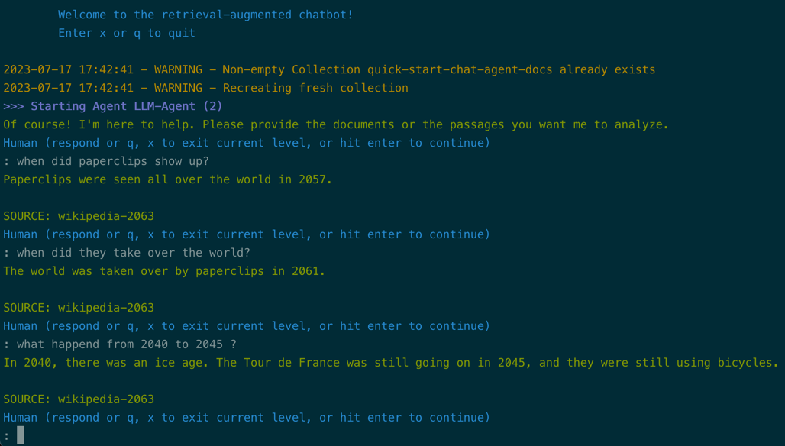

# Augmenting Agents with Retrieval

!!! tip "Script in `langroid-examples`"
    A full working example for the material in this section is
    in the `chat-agent-docs.py` script in the `langroid-examples` repo:
    [`examples/quick-start/chat-agent-docs.py`](https://github.com/langroid/langroid-examples/tree/main/examples/quick-start/chat-agent-docs.py).

## Why is this important?

Until now in this guide, agents have not used external data.
Although LLMs already have enormous amounts of knowledge "hard-wired"
into their weights during training (and this is after all why ChatGPT
has exploded in popularity), for practical enterprise applications
there are a few reasons it is critical to augment LLMs with access to
specific, external documents:

- **Private data**: LLMs are trained on public data, but in many applications
  we want to use private data that is not available to the public.
  For example, a company may want to extract useful information from its private
  knowledge-base.
- **New data**: LLMs are trained on data that was available at the time of training,
  and so they may not be able to answer questions about new topics
- **Constrained responses, or Grounding**: LLMs are trained to generate text that is
  consistent with the distribution of text in the training data.
  However, in many applications we want to constrain the LLM's responses
  to be consistent with the content of a specific document.
  For example, if we want to use an LLM to generate a response to a customer
  support ticket, we want the response to be consistent with the content of the ticket.
  In other words, we want to reduce the chances that the LLM _hallucinates_
  a response that is not consistent with the ticket.

In all these scenarios, we want to augment the LLM with access to a specific
set of documents, and use _retrieval augmented generation_ (RAG) to generate
more relevant, useful, accurate responses. Langroid provides a simple, flexible mechanism 
RAG using vector-stores, thus ensuring **grounded responses** constrained to 
specific documents. Another key feature of Langroid is that retrieval lineage 
is maintained, and responses based on documents are always accompanied by
**source citations**.

## `DocChatAgent` for Retrieval-Augmented Generation

Langroid provides a special type of agent called 
[`DocChatAgent`][langroid.agent.special.doc_chat_agent.DocChatAgent], which is a [`ChatAgent`][langroid.agent.chat_agent.ChatAgent]
augmented with a vector-store, and some special methods that enable the agent
to ingest documents into the vector-store, 
and answer queries based on these documents.

The [`DocChatAgent`][langroid.agent.special.doc_chat_agent.DocChatAgent] provides many ways to ingest documents into the vector-store,
including from URLs and local file-paths and URLs. Given a collection of document paths,
ingesting their content into the vector-store involves the following steps:

1. Split the document into shards (in a configurable way)
2. Map each shard to an embedding vector using an embedding model. The default
  embedding model is OpenAI's `text-embedding-3-small` model, but users can 
  instead use `all-MiniLM-L6-v2` from HuggingFace `sentence-transformers` library.[^1]
3. Store embedding vectors in the vector-store, along with the shard's content and 
  any document-level meta-data (this ensures Langroid knows which document a shard
  came from when it retrieves it augment an LLM query)

[^1]: To use this embedding model, install langroid via `pip install langroid[hf-embeddings]`
Note that this will install `torch` and `sentence-transformers` libraries.


[`DocChatAgent`][langroid.agent.special.doc_chat_agent.DocChatAgent]'s `llm_response` overrides the default [`ChatAgent`][langroid.agent.chat_agent.ChatAgent] method, 
by augmenting the input message with relevant shards from the vector-store,
along with instructions to the LLM to respond based on the shards.

## Define some documents

Let us see how [`DocChatAgent`][langroid.agent.special.doc_chat_agent.DocChatAgent] helps with retrieval-agumented generation (RAG).
For clarity, rather than ingest documents from paths or URLs,
let us just set up some simple documents in the code itself, 
using Langroid's [`Document`][langroid.mytypes.Document] class:

```py
documents =[
    lr.Document(
        content="""
            In the year 2050, GPT10 was released. 
            
            In 2057, paperclips were seen all over the world. 
            
            Global warming was solved in 2060. 
            
            In 2061, the world was taken over by paperclips.         
            
            In 2045, the Tour de France was still going on.
            They were still using bicycles. 
            
            There was one more ice age in 2040.
            """,
        metadata=lr.DocMetaData(source="wikipedia-2063"),
    ),
    lr.Document(
        content="""
            We are living in an alternate universe 
            where Germany has occupied the USA, and the capital of USA is Berlin.
            
            Charlie Chaplin was a great comedian.
            In 2050, all Asian merged into Indonesia.
            """,
        metadata=lr.DocMetaData(source="Almanac"),
    ),
]
```

There are two text documents. We will split them by double-newlines (`\n\n`),
as we see below.

## Configure the DocChatAgent and ingest documents

Following the pattern in Langroid, we first set up a [`DocChatAgentConfig`][langroid.agent.special.doc_chat_agent.DocChatAgentConfig] object
and then instantiate a [`DocChatAgent`][langroid.agent.special.doc_chat_agent.DocChatAgent] from it.

```py
from langroid.agent.special import DocChatAgent, DocChatAgentConfig

config = DocChatAgentConfig(
    llm = lr.language_models.OpenAIGPTConfig(
        chat_model=lr.language_models.OpenAIChatModel.GPT4o,
    ),
    vecdb=lr.vector_store.QdrantDBConfig(
        collection_name="quick-start-chat-agent-docs",
        replace_collection=True, #(1)!
    ),
    parsing=lr.parsing.parser.ParsingConfig(
        separators=["\n\n"],
        splitter=lr.parsing.parser.Splitter.SIMPLE, #(2)!
    ),
    n_similar_chunks=2, #(3)!
    n_relevant_chunks=2, #(3)!
)
agent = DocChatAgent(config)
```

1. Specifies that each time we run the code, we create a fresh collection, 
rather than re-use the existing one with the same name.
2. Specifies to split all text content by the first separator in the `separators` list
3. Specifies that, for a query,
   we want to retrieve at most 2 similar chunks from the vector-store

Now that the [`DocChatAgent`][langroid.agent.special.doc_chat_agent.DocChatAgent] is configured, we can ingest the documents 
into the vector-store:

```py

agent.ingest_docs(documents)
```

## Setup the task and run it

As before, all that remains is to set up the task and run it:

```py
task = lr.Task(agent)
task.run()
```

And that is all there is to it!
Feel free to try out the 
[`chat-agent-docs.py`](https://github.com/langroid/langroid-examples/blob/main/examples/quick-start/chat-agent-docs.py)
script in the
`langroid-examples` repository.

Here is a screenshot of the output:



Notice how follow-up questions correctly take the preceding dialog into account,
and every answer is accompanied by a source citation.

## Answer questions from a set of URLs

Instead of having in-code documents as above, what if you had a set of URLs
instead -- how do you use Langroid to answer questions based on the content 
of those URLS?

[`DocChatAgent`][langroid.agent.special.doc_chat_agent.DocChatAgent] makes it very simple to do this. 
First include the URLs in the [`DocChatAgentConfig`][langroid.agent.special.doc_chat_agent.DocChatAgentConfig] object:

```py
config = DocChatAgentConfig(
  doc_paths = [
    "https://cthiriet.com/articles/scaling-laws",
    "https://www.jasonwei.net/blog/emergence",
  ]
)
```

Then, call the `ingest()` method of the [`DocChatAgent`][langroid.agent.special.doc_chat_agent.DocChatAgent] object:

```py
agent.ingest()
```
And the rest of the code remains the same.

## See also
In the `langroid-examples` repository, you can find full working examples of
document question-answering:

- [`examples/docqa/chat.py`](https://github.com/langroid/langroid-examples/blob/main/examples/docqa/chat.py)
  an app that takes a list of URLs or document paths from a user, and answers questions on them.
- [`examples/docqa/chat-qa-summarize.py`](https://github.com/langroid/langroid-examples/blob/main/examples/docqa/chat-qa-summarize.py)
  a two-agent app where the `WriterAgent` is tasked with writing 5 key points about a topic, 
  and takes the help of a `DocAgent` that answers its questions based on a given set of documents.


## Next steps

This Getting Started guide walked you through the core features of Langroid.
If you want to see full working examples combining these elements, 
have a look at the 
[`examples`](https://github.com/langroid/langroid-examples/tree/main/examples)
folder in the `langroid-examples` repo. 


