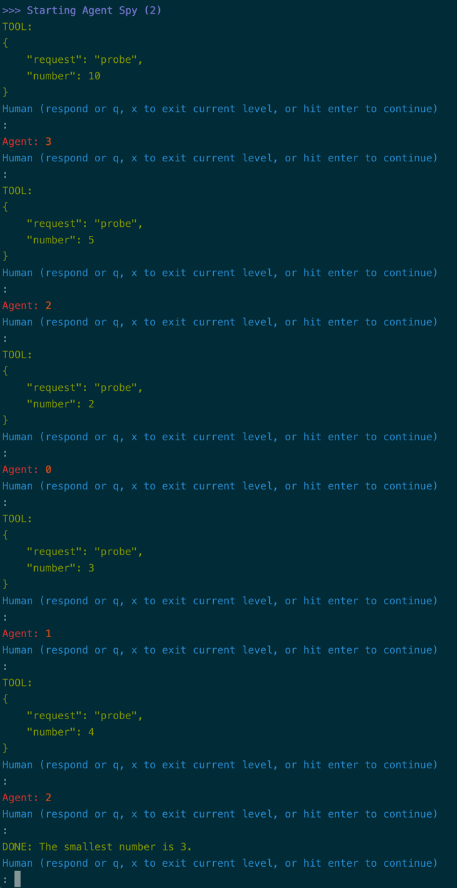

# A chat agent, equipped with a tool/function-call

!!! tip "Script in `langroid-examples`"
      A full working example for the material in this section is
      in the `chat-agent-tool.py` script in the `langroid-examples` repo:
      [`examples/quick-start/chat-agent-tool.py`](https://github.com/langroid/langroid-examples/tree/main/examples/quick-start/chat-agent-tool.py).

## Tools, plugins, function-calling

An LLM normally generates unstructured text in response to a prompt
(or sequence of prompts). However there are many situations where we would like the LLM
to generate _structured_ text, or even _code_, that can be handled by specialized
functions outside the LLM, for further processing. 
In these situations, we want the LLM to "express" its "intent" unambiguously,
and we achieve this by instructing the LLM on how to format its output
(typically in JSON) and under what conditions it should generate such output.
This mechanism has become known by various names over the last few months
(tools, plugins, or function-calling), and is extremely useful in numerous scenarios,
such as:

- **Extracting structured information** from a document: for example, we can use 
the tool/functions mechanism to have the LLM present the key terms in a lease document
in a JSON structured format, to simplify further processing. 
See an [example](https://github.com/langroid/langroid-examples/blob/main/examples/docqa/chat_multi_extract.py) of this in the `langroid-examples` repo. 
- **Specialized computation**: the LLM can request a units conversion, 
or request scanning a large file (which wouldn't fit into its context) for a specific
pattern.
- **Code execution**: the LLM can generate code that is executed in a sandboxed
environment, and the results of the execution are returned to the LLM.
- **API Calls**: the LLM can generate a JSON containing params for an API call,
  which the tool handler uses to make the call and return the results to the LLM.


For LLM developers, Langroid provides a clean, uniform interface
for the recently released OpenAI [Function-calling](https://platform.openai.com/docs/guides/gpt/function-calling)
as well Langroid's own native "tools" mechanism. The native tools mechanism is meant to be
used when working with non-OpenAI LLMs that do not have a "native" function-calling facility.
You can choose which to enable by setting the 
`use_tools` and `use_functions_api` flags in the `ChatAgentConfig` object.
(Or you can omit setting these, and langroid auto-selects the best mode
depending on the LLM).
The implementation leverages the excellent 
[Pydantic](https://docs.pydantic.dev/latest/) library.
Benefits of using Pydantic are that you never have to write complex JSON specs 
for function calling, and when the LLM hallucinates malformed JSON, 
the Pydantic error message is sent back to the LLM so it can fix it!

## Example: find the smallest number in a list

Again we will use a simple number-game as a toy example to quickly and succinctly
illustrate the ideas without spending too much on token costs. 
This is a modification of the `chat-agent.py` example we saw in an earlier
[section](chat-agent.md). The idea of this single-agent game is that
the agent has in "mind" a list of numbers between 1 and 100, and the LLM has to
find out the smallest number from this list. The LLM has access to a `probe` tool 
(think of it as a function) that takes an argument `number`. When the LLM 
"uses" this tool (i.e. outputs a message in the format required by the tool),
the agent handles this structured message and responds with 
the number of values in its list that are at most equal to the `number` argument. 

## Define the tool as a `ToolMessage`

The first step is to define the tool, which we call `ProbeTool`,
as an instance of the `ToolMessage` class,
which is itself derived from Pydantic's `BaseModel`.
Essentially the `ProbeTool` definition specifies 

- the name of the Agent method that handles the tool, in this case `probe`
- the fields that must be included in the tool message, in this case `number`
- the "purpose" of the tool, i.e. under what conditions it should be used, and what it does

Here is what the `ProbeTool` definition looks like:
```py
class ProbeTool(lr.agent.ToolMessage):
    request: str = "probe" #(1)!
    purpose: str = """ 
        To find which number in my list is closest to the <number> you specify
        """ #(2)!
    number: int #(3)!

    @classmethod
    def examples(cls): #(4)!
        # Compiled to few-shot examples sent along with the tool instructions.
        return [
            cls(number=10),
            (
                "To find which number is closest to 20",
                cls(number=20),
            )
        ]
```

1. This indicates that the agent's `probe` method will handle this tool-message.
2. The `purpose` is used behind the scenes to instruct the LLM
3. `number` is a required argument of the tool-message (function)
4. You can optionally include a class method that returns a list containing examples, 
   of two types: either a class instance, or a tuple consisting of a description and a 
   class instance, where the description is the "thought" that leads the LLM to use the
   tool. In some scenarios this can help with LLM tool-generation accuracy.

!!! note "Stateless tool handlers"
      The above `ProbeTool` is "stateful", i.e. it requires access to a variable in
      the Agent instance (the `numbers` variable). This is why handling this 
      tool-message requires subclassing the `ChatAgent` and defining a special method 
      in the Agent, with a name matching the value of the `request` field of the Tool 
      (`probe` in this case). However you may often define "stateless tools" which 
      don't require access to the Agent's state. For such tools, you can define a 
      handler method right in the `ToolMessage` itself, with a name `handle`. Langroid 
      looks for such a method in the `ToolMessage` and automatically inserts it into 
      the Agent as a method with name matching the `request` field of the Tool. Examples of
      stateless tools include tools for numerical computation 
      (e.g., in [this example](https://langroid.github.io/langroid/examples/agent-tree/)),
      or API calls (e.g. for internet search, see 
      [DuckDuckGoSearch Tool][langroid.agent.tools.duckduckgo_search_tool.DuckduckgoSearchTool]).
        

## Define the ChatAgent, with the `probe` method

As before we first create a `ChatAgentConfig` object:

```py
config = lr.ChatAgentConfig(
    name="Spy",
    llm = lr.language_models.OpenAIGPTConfig(
        chat_model=lr.language_models.OpenAIChatModel.GPT4o,
    ),
    use_tools=True, #(1)!
    use_functions_api=False, #(2)!
    vecdb=None,
)
```

1. whether to use langroid's native tools mechanism
2. whether to use OpenAI's function-calling mechanism

Next we define the Agent class itself, which we call `SpyGameAgent`,
with a member variable to hold its "secret" list of numbers.
We also add `probe` method (to handle the `ProbeTool` message)
to this class, and instantiate it:

```py
class SpyGameAgent(lr.ChatAgent):
    def __init__(self, config: lr.ChatAgentConfig):
        super().__init__(config)
        self.numbers = [3, 4, 8, 11, 15, 25, 40, 80, 90]

    def probe(self, msg: ProbeTool) -> str: #(1)!
        # return how many values in self.numbers are less or equal to msg.number
        return str(len([n for n in self.numbers if n <= msg.number]))

spy_game_agent = SpyGameAgent(config)
``` 

1. Note that this method name exactly matches the value of the `request` field in the 
   `ProbeTool` definition. This ensures that this method is called when the LLM 
   generates a valid `ProbeTool` message.

## Enable the `spy_game_agent` to handle the `probe` tool

The final step in setting up the tool is to enable 
the `spy_game_agent` to handle the `probe` tool:

```py
spy_game_agent.enable_message(ProbeTool)
```

## Set up the task and instructions

We set up the task for the `spy_game_agent` and run it:

```py
task = lr.Task(
   spy_game_agent,
   system_message="""
            I have a list of numbers between 1 and 100. 
            Your job is to find the smallest of them.
            To help with this, you can give me a number and I will
            tell you how many of my numbers are equal or less than your number.
            Once you have found the smallest number,
            you can say DONE and report your answer.
        """
)
task.run()
```
Notice that in the task setup we 
have _not_ explicitly instructed the LLM to use the `probe` tool.
But this is done "behind the scenes", either by the OpenAI API 
(when we use function-calling by setting the `use_functions_api` flag to `True`),
or by Langroid's native tools mechanism (when we set the `use_tools` flag to `True`).


!!! note "Asynchoronous tool handlers"
      If you run task asynchronously - i.e. via `await task.run_async()` - you may provide
      asynchronous tool handler by implementing `probe_async` method.


See the [`chat-agent-tool.py`](https://github.com/langroid/langroid-examples/blob/main/examples/quick-start/chat-agent-tool.py)
in the `langroid-examples` repo, for a working example that you can run as follows:
```sh
python3 examples/quick-start/chat-agent-tool.py
```

Here is a screenshot of the chat in action, using Langroid's tools mechanism



And if we run it with the `-f` flag (to switch to using OpenAI function-calling):


## See also
One of the uses of tools/function-calling is to **extract structured information** from 
a document. In the `langroid-examples` repo, there are two examples of this: 

- [`examples/extract/chat.py`](https://github.com/langroid/langroid-examples/blob/main/examples/extract/chat.py), 
  which shows how to extract Machine Learning model quality information from a description of 
  a solution approach on Kaggle.
- [`examples/docqa/chat_multi_extract.py`](https://github.com/langroid/langroid-examples/blob/main/examples/docqa/chat_multi_extract.py)
  which extracts key terms from a commercial lease document, in a nested JSON format.

## Next steps

In the [3-agent chat example](three-agent-chat-num.md), recall that the `processor_agent` did not have to
bother with specifying who should handle the current number. In the [next section](three-agent-chat-num-router.md) we add a twist to this game,
so that the `processor_agent` has to decide who should handle the current number.


