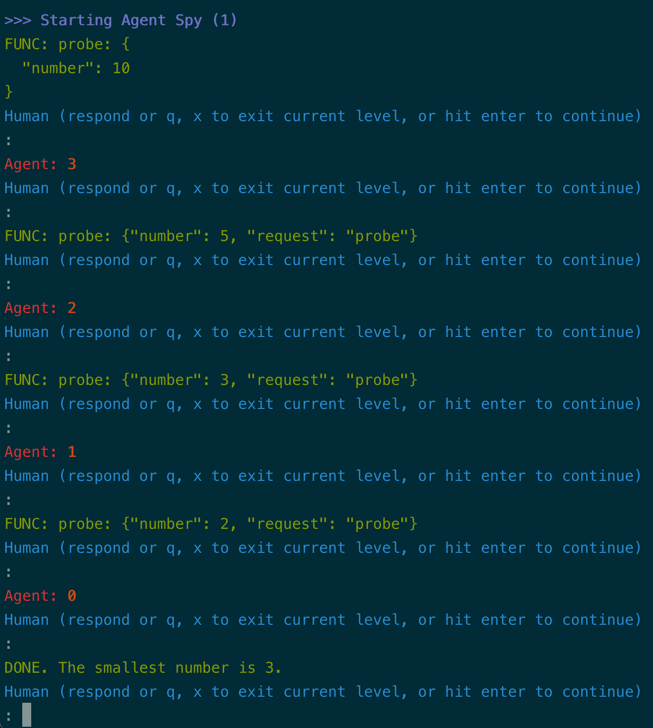

# A chat agent, equipped with a tool/function-call

!!! tip "Script in `langroid-examples`"
      A full working example for the material in this section is
      in the `chat-agent-tool.py` script in the `langroid-examples` repo:
      [`examples/quick-start/chat-agent-tool.py`](https://github.com/langroid/langroid-examples/tree/main/examples/quick-start/chat-agent-tool.py).

## Tools, plugins, function-calling

An LLM normally generates unstructured text in response to a prompt
(or sequence of prompts). However there are many situations where we would like the LLM
to generate _structured_ text, or even _code_, that can be handled by specialized
functions outside the LLM, for further processing. 
In these situations, we want the LLM to "express" its "intent" unambiguously,
and we achieve this by instructing the LLM on how to format its output
(typically in JSON) and under what conditions it should generate such output.
This mechanism has become known by various names over the last few months
(tools, plugins, or function-calling), and is extremely useful in numerous scenarios,
such as:

- **Extracting structured information** from a document: for example, we can use 
the tool/functions mechanism to have the LLM present information from a lease document
in a JSON structured format, to simplify further processing.
- **Specialized computation**: the LLM can request a units conversion, 
or request scanning a large file (which wouldn't fit into its context) for a specific
pattern.
- **Code execution**: the LLM can generate code that is executed in a sandboxed
environment, and the results of the execution are returned to the LLM.


For LLM developers, Langroid provides a clean, uniform interface
for the recently released OpenAI [Function-calling](https://platform.openai.com/docs/guides/gpt/function-calling)
as well Langroid's own native "tools" mechanism.
You can choose which to enable by setting the 
`use_tools` and `use_functions_api` flags in the `ChatAgentConfig` object.
The implementation leverages the excellent 
[Pydantic](https://docs.pydantic.dev/latest/) library.
Benefits of using Pydantic are that you never have to write complex JSON specs 
for function calling, and when the LLM hallucinates malformed JSON, 
the Pydantic error message is sent back to the LLM so it can fix it!

## Example: a number guessing game

Again we will use a simple number-game as a toy example to quickly and succinctly
illustrate the ideas without spending too much on token costs. 
This is a modification of the `chat-agent.py` example we saw in an earlier
[section](chat-agent.md). The idea of this single-agent game is that
the agent has in "mind" a list of numbers between 1 and 100, and the LLM has to 
find at least 4 numbers from this list. The LLM has access to a `probe` tool 
(think of it as a function) that takes an argument `number`. When the LLM 
"uses" this tool (i.e. outputs a message in the format required by the tool),
the agent handles this structured message and responds with the
nearest number in the list to the `number` argument. 

## Define the tool as a `ToolMessage`

The first step is to define the tool, which we call `ProbeTool`,
as an instance of the `ToolMessage` class,
which is itself derived from Pydantic's `BaseModel`.
Essentially the `ProbeTool` definition specifies 

- the name of the Agent method that handles the tool, in this case `probe`
- the fields that must be included in the tool message, in this case `number`
- the "purpose" of the tool, i.e. under what conditions it should be used, and what it does

Here is what the `ProbeTool` definition looks like:
```py
class ProbeTool(ToolMessage):
    request: str = "probe" #(1)!
    purpose: str = """ 
        To find which number in my list is closest to the <number> you specify
        """ #(2)!
    number: int #(3)!

    @classmethod
    def examples(cls) -> List["ProbeTool"]: #(4)!
        return [
            cls(number=1),
            cls(number=5),
        ]

```

1. this indicates that the agent's `probe` method will handle this tool-message
2. The `purpose` is used behind the scenes to instruct the LLM
3. `number` is a required argument of the tool-message (function)
4. Not strictly needed, but useful for documentation and testing, or for 
   generating an example tool-message if needed.

## Define the ChatAgent, with the `probe` method

As before we first create a `ChatAgentConfig` object:

```py
config = ChatAgentConfig(
    name="Spy",
    llm = OpenAIGPTConfig(
        chat_model=OpenAIChatModel.GPT4,
    ),
    use_tools=True, #(1)!
    use_functions_api=False, #(2)!
    vecdb=None,
)
```

1. whether to use langroid's native tools mechanism
2. whether to use OpenAI's function-calling mechanism

Next we define the Agent class itself, with the `probe` method, 
and instantiate it:

```py
class SpyGameAgent(ChatAgent):
  def __init__(self, config: ChatAgentConfig):
    super().__init__(config)
    self.numbers = [1, 3, 4, 8, 11, 15, 25, 40, 80, 90]

  def probe(self, msg: ProbeTool) -> str:
    # return the number in self.numbers that is closest to the number
    distances = [abs(msg.number - n) for n in self.numbers]
    return str(self.numbers[distances.index(min(distances))])

spy_game_agent = SpyGameAgent(config)
``` 

## Enable the `spy_game_agent` to handle the `probe` tool

The final step in setting up the tool is to enable 
the `spy_game_agent` to handle the `probe` tool:

```py
spy_game_agent.enable_message(ProbeTool)
```

## Set up the task and instructions

We set up the task for the `spy_game_agent` and run it:

```py
task = Task(
   spy_game_agent,
   system_message="""
            I have a list of numbers between 1 and 100. 
            Your job is to find at least 4 of them.
            To help with this, you can give me a number and I will
            tell you the nearest number in my list.
            Once you have found at least 4 numbers, 
            you can say DONE and report those numbers to me. 
        """
)
task.run()
```
Notice that in the task setup we 
have not explicitly instructed the LLM to use the `probe` tool.
But this is done "behind the scenes", either by the OpenAI API 
(when we use function-calling by setting the `use_functions_api` flag to `True`),
or by Langroid's native tools mechanism (when we set the `use_tools` flag to `True`).


See the [`chat-agent-tool.py](https://github.com/langroid/langroid-examples/blob/main/examples/quick-start/chat-agent-tool.py)
in the `langroid-examples` repo, for a working example that you can run as follows:
```sh
python3 examples/quick-start/chat-agent-tool.py
```

Here is a screenshot of the chat in action, using Langroid's tools mechanism


And if we run it with the `-f` flag (to switch to using OpenAI function-calling):



In the [next section](chat-agent-docs.md) you will learn
how to use Langroid with external documents.


