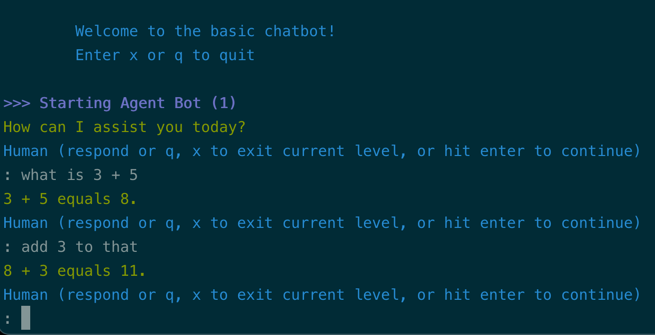

# A simple chat agent

!!! tip "Script in `langroid-examples`"
    A full working example for the material in this section is
    in the `chat-agent.py` script in the `langroid-examples` repo:
    [`examples/quick-start/chat-agent.py`](https://github.com/langroid/langroid-examples/tree/main/examples/quick-start/chat-agent.py).

## Agents 

A [`ChatAgent`][langroid.agent.chat_agent.ChatAgent] is an abstraction that 
wraps a few components, including:

- an LLM (`ChatAgent.llm`), possibly equipped with tools/function-calling. 
  The `ChatAgent` class maintains LLM conversation history.
- optionally a vector-database (`ChatAgent.vecdb`)

## Agents as message transformers
In Langroid, a core function of `ChatAgents` is _message transformation_.
There are three special message transformation methods, which we call **responders**.
Each of these takes a message and returns a message. 
More specifically, their function signature is (simplified somewhat):
```py
str | ChatDocument -> ChatDocument
```
where `ChatDocument` is a class that wraps a message content (text) and its metadata.
There are three responder methods in `ChatAgent`, one corresponding to each 
[responding entity][langroid.mytypes.Entity] (`LLM`, `USER`, or `AGENT`):

- `llm_response`: returns the LLM response to the input message.
  (The input message is added to the LLM history, and so is the subsequent response.)
- `agent_response`: a method that can be used to implement a custom agent response. 
   Typically, an `agent_response` is used to handle messages containing a 
   "tool" or "function-calling" (more on this later). Another use of `agent_response` 
   is _message validation_.
- `user_response`: get input from the user. Useful to allow a human user to 
   intervene or quit.

Creating an agent is easy. First define a `ChatAgentConfig` object, and then
instantiate a `ChatAgent` object with that config:
```py
import langroid as lr

config = lr.ChatAgentConfig( #(1)!
    name="MyAgent", # note there should be no spaces in the name!
    llm = lr.language_models.OpenAIGPTConfig(
      chat_model=lr.language_models.OpenAIChatModel.GPT4o,
    ),
    system_message="You are a helpful assistant" #(2)! 
)
agent = lr.ChatAgent(config)
```

1. This agent only has an LLM, and no vector-store. Examples of agents with
   vector-stores will be shown later.
2. The `system_message` is used when invoking the agent's `llm_response` method; it is 
   passed to the LLM API as the first message (with role `"system"`), followed by the alternating series of user, 
   assistant messages. Note that a `system_message` can also be specified when initializing a `Task` object (as seen 
   below); in this case the `Task` `system_message` overrides the agent's `system_message`.

We can now use the agent's responder methods, for example:
```py
response = agent.llm_response("What is 2 + 4?")
if response is not None:
    print(response.content)
response = agent.user_response("add 3 to this")
...
```
The `ChatAgent` conveniently accumulates message history so you don't have to,
as you did in the [previous section](llm-interaction.md) with direct LLM usage.
However to create an interative loop involving the human user, you still 
need to write your own. The `Task` abstraction frees you from this, as we see
below.

## Task: orchestrator for agents
In order to do anything useful with a `ChatAgent`, we need to have a way to 
sequentially invoke its responder methods, in a principled way.
For example in the simple chat loop we saw in the 
[previous section](llm-interaction.md), in the 
[`try-llm.py`](https://github.com/langroid/langroid-examples/blob/main/examples/quick-start/try-llm.py)
script, we had a loop that alternated between getting a human input and an LLM response.
This is one of the simplest possible loops, but in more complex applications, 
we need a general way to orchestrate the agent's responder methods.

The [`Task`][langroid.agent.task.Task] class is an abstraction around a 
`ChatAgent`, responsible for iterating over the agent's responder methods,
as well as orchestrating delegation and hand-offs among multiple tasks.
A `Task` is initialized with a specific `ChatAgent` instance, and some 
optional arguments, including an initial message to "kick-off" the agent.
The `Task.run()` method is the main entry point for `Task` objects, and works 
as follows:

- it first calls the `Task.init()` method to initialize the `pending_message`, 
  which represents the latest message that needs a response.
- it then repeatedly calls `Task.step()` until `Task.done()` is True, and returns
  `Task.result()` as the final result of the task.

`Task.step()` is where all the action happens. It represents a "turn" in the 
"conversation": in the case of a single `ChatAgent`, the conversation involves 
only the three responders mentioned above, but when a `Task` has sub-tasks, 
it can involve other tasks well 
(we see this in the [a later section](two-agent-chat-num.md) but ignore this for now). 
`Task.step()` loops over 
the `ChatAgent`'s responders (plus sub-tasks if any) until it finds a _valid_ 
response[^1] to the current `pending_message`, i.e. a "meaningful" response, 
something other than `None` for example.
Once `Task.step()` finds a valid response, it updates the `pending_message` 
with this response,
and the next invocation of `Task.step()` will search for a valid response to this 
updated message, and so on.
`Task.step()` incorporates mechanisms to ensure proper handling of messages,
e.g. the USER gets a chance to respond after each non-USER response
(to avoid infinite runs without human intervention),
and preventing an entity from responding if it has just responded, etc.

[^1]: To customize a Task's behavior you can subclass it and 
override methods like `valid()`, `done()`, `result()`, or even `step()`.

!!! note "`Task.run()` has the same signature as agent's responder methods."
    The key to composability of tasks is that `Task.run()` 
    *has exactly the same type-signature as any of the agent's responder methods*, 
    i.e. `str | ChatDocument -> ChatDocument`. This means that a `Task` can be
    used as a responder in another `Task`, and so on recursively. 
    We will see this in action in the [Two Agent Chat section](two-agent-chat-num.md).

The above details were only provided to give you a glimpse into how Agents and 
Tasks work. Unless you are creating a custom orchestration mechanism, you do not
need to be aware of these details. In fact our basic human + LLM chat loop can be trivially 
implemented with a `Task`, in a couple of lines of code:
```py
task = lr.Task(
    agent, 
    name="Bot", #(1)!
    system_message="You are a helpful assistant", #(2)!
)
```
1. If specified, overrides the agent's `name`. 
   (Note that the agent's name is displayed in the conversation shown in the console.)
  However, typical practice is to just define the `name` in the `ChatAgentConfig` object, as we did above.
2. If specified, overrides the agent's `system_message`. Typical practice is to just
 define the `system_message` in the `ChatAgentConfig` object, as we did above.


We can then run the task:
```py
task.run() #(1)!
```

1. Note how this hides all of the complexity of constructing and updating a 
   sequence of `LLMMessages`


Note that the agent's `agent_response()` method always returns `None` (since the default 
implementation of this method looks for a tool/function-call, and these never occur
in this task). So the calls to `task.step()` result in alternating responses from
the LLM and the user.

See [`chat-agent.py`](https://github.com/langroid/langroid-examples/blob/main/examples/quick-start/chat-agent.py)
for a working example that you can run with
```sh
python3 examples/quick-start/chat-agent.py
```

Here is a screenshot of the chat in action:[^2]



## Next steps

In the [next section](multi-agent-task-delegation.md) you will 
learn some general principles on how to have multiple agents collaborate 
on a task using Langroid.

[^2]: In the screenshot, the numbers in parentheses indicate how many 
    messages have accumulated in the LLM's message history. 
    This is only provided for informational and debugging purposes, and 
    you can ignore it for now.


