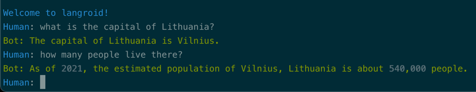

!!! tip "Script in `langroid-examples`"
    A full working example for the material in this section is 
    in the `try-llm.py` script in the `langroid-examples` repo:
    [`examples/quick-start/try-llm.py`](https://github.com/langroid/langroid-examples/tree/main/examples/quick-start/try-llm.py).
        

Let's start with the basics -- how to directly interact with an OpenAI LLM
using Langroid.

### Configure, instantiate the LLM class

First define the configuration for the LLM, in this case one of the
OpenAI GPT chat models:
```py
import langroid as lr

cfg = lr.language_models.OpenAIGPTConfig(
    chat_model=lr.language_models.OpenAIChatModel.GPT4o,
)
```
!!! info inline end "About Configs"
    A recurring pattern you will see in Langroid is that for many classes,
    we have a corresponding `Config` class (an instance of a Pydantic `BaseModel`),
    and the class constructor takes this `Config` class as its only argument.
    This lets us avoid having long argument lists in constructors, and brings flexibility
    since adding a new argument to the constructor is as simple as adding a new field
    to the corresponding `Config` class.
    For example the constructor for the `OpenAIGPT` class takes a single argument,
    an instance of the `OpenAIGPTConfig` class.

Now that we've defined the configuration of the LLM, we can instantiate it:
```py
mdl = lr.language_models.OpenAIGPT(cfg)
```


We will use OpenAI's GPT4 model's [chat completion API](https://platform.openai.com/docs/guides/gpt/chat-completions-api).

### Messages: The `LLMMessage` class

This API takes a list of "messages" as input -- this is typically the conversation
history so far, consisting of an initial system message, followed by a sequence
of alternating messages from the LLM ("Assistant") and the user.
Langroid provides an abstraction 
[`LLMMessage`][langroid.language_models.base.LLMMessage] to construct messages, e.g.
```py
from langroid.language_models import Role, LLMMessage

msg = LLMMessage(
    content="what is the capital of Bangladesh?", 
    role=Role.USER
)
```

### LLM response to a sequence of messages

To get a response from the LLM, we call the mdl's `chat` method,
and pass in a list of messages, along with a bound on how long (in tokens)
we want the response to be:
```py
messages = [
    LLMMessage(content="You are a helpful assistant", role=Role.SYSTEM), #(1)!
    LLMMessage(content="What is the capital of Ontario?", role=Role.USER), #(2)!
]

response = mdl.chat(messages, max_tokens=200)
```

1. :man_raising_hand: With a system message, you can assign a "role" to the LLM
2. :man_raising_hand: Responses from the LLM will have role `Role.ASSISTANT`;
   this is done behind the scenes by the `response.to_LLMMessage()` call below.

The response is an object of class [`LLMResponse`][langroid.language_models.base.LLMResponse], 
which we can convert to an
[`LLMMessage`][langroid.language_models.base.LLMMessage] to append to the conversation history:
```py
messages.append(response.to_LLMMessage())
```

You can put the above in a simple loop, 
to get a simple command-line chat interface!

```py
from rich import print
from rich.prompt import Prompt #(1)!

messages = [
    LLMMessage(role=Role.SYSTEM, content="You are a helpful assitant"),
]

while True:
    message = Prompt.ask("[blue]Human")
    if message in ["x", "q"]:
        print("[magenta]Bye!")
        break
    messages.append(LLMMessage(role=Role.USER, content=message))

    response = mdl.chat(messages=messages, max_tokens=200)
    messages.append(response.to_LLMMessage())
    print("[green]Bot: " + response.message)
```

1. Rich is a Python library for rich text and beautiful formatting in the terminal.
   We use it here to get a nice prompt for the user's input.
   You can install it with `pip install rich`.

See [`examples/quick-start/try-llm.py`](https://github.com/langroid/langroid-examples/blob/main/examples/quick-start/try-llm.py)
for a complete example that you can run using
```bash
python3 examples/quick-start/try-llm.py
```

Here is a screenshot of what it looks like:



### Next steps
You might be thinking: 
"_It is tedious to keep track of the LLM conversation history and set up a 
loop. Does Langroid provide any abstractions to make this easier?_"

We're glad you asked! And this leads to the notion of an `Agent`. 
The [next section](chat-agent.md) will show you how to use the `ChatAgent` class 
to set up a simple chat Agent in a couple of lines of code.

