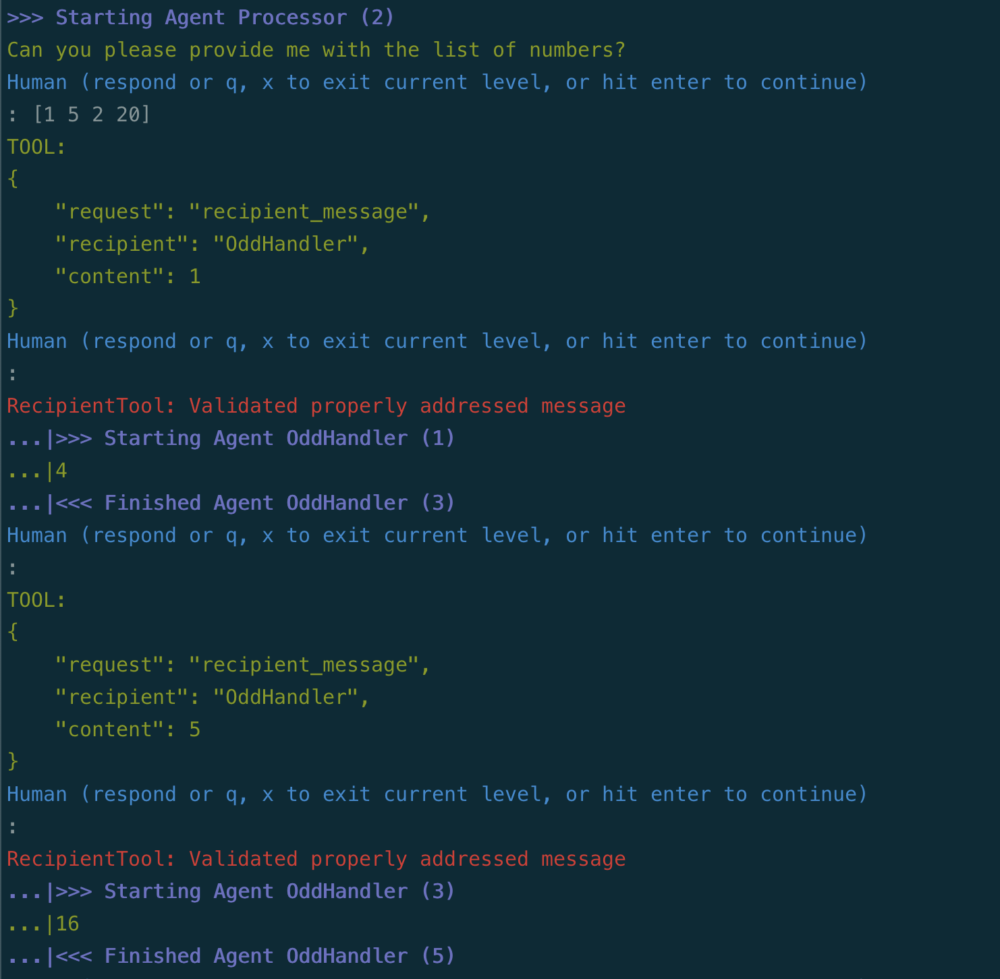

# Three-Agent Collaboration, with message Routing

!!! tip "Script in `langroid-examples`"
        A full working example for the material in this section is
        in the `three-agent-chat-num-router.py` script in the `langroid-examples` repo:
        [`examples/quick-start/three-agent-chat-num-router.py`](https://github.com/langroid/langroid-examples/tree/main/examples/quick-start/three-agent-chat-num-router.py).

Let's change the number game from the [previous section](three-agent-chat-num.md) slightly.
In that example, when the `even_agent`'s LLM receives an odd number,
it responds with `DO-NOT-KNOW`, and similarly for the `odd_agent` when it
receives an even number. The `step()` method of the `repeater_task`
considers `DO-NOT-KNOW` to be an _invalid_ response and continues to 
look for a valid response from any remaining sub-tasks.

But what if there is a scenario where the `even_agent` and `odd_agent`
might return a legit but "wrong" answer?
In this section we add this twist -- when
the `even_agent` receives an odd number, it responds with -10, and similarly
for the `odd_agent` when it receives an even number.
We set the goal for the `repeater_agent` (which we now rename to 
`router_agent`) to never get a negative number.

The goal we have set for the `router_agent` implies that it 
must specify the intended recipient of 
the number it is sending, by starting its message with 
"TO[EvenHandler]" or "TO[OddHandler]". So when setting up the
`router_task` we include instructions to this effect:

```py
router_agent = ChatAgent(config)
router_task = Task(
    router_agent,
    name = "Router",
    system_message="""
    Your job is to send the current number to one of two people:
    If the number is even, send it to EvenHandler,
    and if it is odd, send it to OddHandler.
    The handlers will transform the number and give you a new number.
    If you send it to the wrong person, you will receive a negative value.
    Your goal is to never get a negative number, so you must 
    clearly specify who you are sending the number to, by starting 
    your message with "TO[EvenHandler]:" or "TO[OddHandler]:".
    For example, you could say "TO[EvenHandler]: 4".
    """,
    llm_delegate=True,
    single_round=False,
)
```


The specification
of the `even_agent`, `odd_agent` and corresponding tasks is the same as before,
but we need to instruct the `router_agent` to specify the intended recipient:

At this point, we might think we could simply add the two handler tasks
as sub-tasks of the `router_task`, like this:
```python
router_task.add_subtask([even_task, odd_task])
```
However, this will _not_ work in general, at least with the current LLM champion
(GPT4):
> Although in the beginning of the conversation, the `router_agent` dutifully
> uses the `TO[<recipient>]` prefix to specify the recipient,
> after a few turns, the `router_agent` **starts to omit this prefix** --
> Welcome to LLM Brittleness!

So how do we deal with this? Fortunately, Langroid provides a "special agent"
(no pun intended) called [`RecipientValidator`](/reference/agent/special/recipient_validator_agent)
whose job is to check if a recipient has been specified,
and if not, ask the sending LLM to clarify who it is for.
There can be two outcomes: the LLM either resends its entire message
with the proper recipient prefix, or it simply specifies the recipient name.
In the latter case, the RecipientValidator will "agument" the LLM's original
message with the specified recipient, and adjusts internval variables
so that  the `Task.step()` sees this augmented message as if it came from the
LLM ifself.

Let's see how this works in practice. First, we create a RecipientValidator
and the corresponding task:

```py
validator_agent = RecipientValidator(
    RecipientValidatorConfig(
        recipients=["EvenHandler", "OddHandler"], #(1)!
    )
)
validator_task = Task(validator_agent, single_round=True)
```

1. Here we specify who the possible recipients are, in our context


Now we add **three subtasks** to the `router_task`, and then run it as before:
```python
router_task.add_subtask(
    [validator_task, even_task, odd_task] #(1)!
)
router_task.run()
```

1. Strictly speaking we actually have _four_ collaborating agents


Feel free to try the working example script
`three-agent-chat-num-router.py` in the 
`langroid-examples` repo:
[`examples/quick-start/three-agent-chat-num-router.py`](https://github.com/langroid/langroid-examples/tree/main/examples/quick-start/three-agent-chat-num-router.py):

```bash
python3 examples/quick-start/three-agent-chat-num-router.py
```

Below is screenshot of what this might look like. 
Notice how the `Router` agent forgets to specify the recipient,
and how the `RecipientValidator` asks it to clarify who it is for.



## Next steps
In the [next section](chat-agent-tool.md) you will learn how to use Langroid
to equip a `ChatAgent` with tools or function-calling. 
