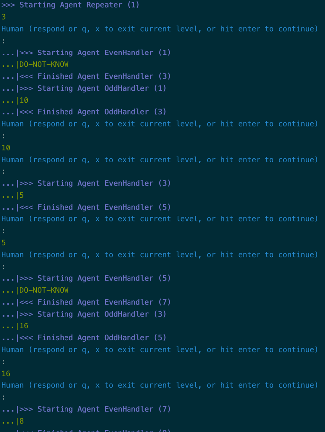

# Three-Agent Collaboration

!!! tip "Script in `langroid-examples`"
    A full working example for the material in this section is
    in the `three-agent-chat-num.py` script in the `langroid-examples` repo:
    [`examples/quick-start/three-agent-chat-num.py`](https://github.com/langroid/langroid-examples/tree/main/examples/quick-start/three-agent-chat-num.py).


Let us set up a simple numbers exercise between 3 agents.
The `Processor` agent receives a number $n$, and its goal is to 
apply a transformation to the it. However it does not know how to apply the
transformation, and takes the help of two other agents to do so.
Given a number $n$,

- The `EvenHandler` returns $n/2$ if n is even, otherwise says `DO-NOT-KNOW`.
- The `OddHandler` returns $3n+1$ if n is odd, otherwise says `DO-NOT-KNOW`.

We'll first define a shared LLM config:

```py
llm_config = lr.language_models.OpenAIGPTConfig(
    chat_model=lr.language_models.OpenAIChatModel.GPT4o,
    # or, e.g., "ollama/qwen2.5-coder:latest", or "gemini/gemini-2.0-flash-exp"
)
```

Next define the config for the `Processor` agent:
```py
processor_config = lr.ChatAgentConfig(
    name="Processor",
    llm = llm_config,
    system_message="""
    You will receive a number from the user.
    Simply repeat that number, DO NOT SAY ANYTHING else,
    and wait for a TRANSFORMATION of the number 
    to be returned to you.
    
    Once you have received the RESULT, simply say "DONE",
    do not say anything else.
    """,        
    vecdb=None,
)
```

Then set up the `processor_agent`, along with the corresponding task:
```py
processor_agent = lr.ChatAgent(processor_config)

processor_task = lr.Task(
    processor_agent,
    llm_delegate=True, #(1)!
    interactive=False, #(2)!
    single_round=False, #(3)!
)

```

1. Setting the `llm_delegate` option to `True` means that the `processor_task` is
    delegated to the LLM (as opposed to the User), 
    in the sense that the LLM is the one "seeking" a response to the latest 
    number. Specifically, this means that in the `processor_task.step()` 
    when a sub-task returns `DO-NOT-KNOW`,
    it is _not_ considered a valid response, and the search for a valid response 
    continues to the next sub-task if any.
2. `interactive=False` means the task loop will not wait for user input.
3. `single_round=False` means that the `processor_task` should _not_ terminate after 
    a valid response from a responder.

Set up the other two agents and tasks:

```py
NO_ANSWER = lr.utils.constants.NO_ANSWER

even_config = lr.ChatAgentConfig(
    name="EvenHandler",
    llm = llm_config,
    system_message=f"""
    You will be given a number N. Respond as follows:
    
    - If N is even, divide N by 2 and show the result, 
      in the format: 
        RESULT = <result>
      and say NOTHING ELSE.
    - If N is odd, say {NO_ANSWER}
    """,    
)
even_agent = lr.ChatAgent(even_config)
even_task = lr.Task(
    even_agent,
    single_round=True,  # task done after 1 step() with valid response
)

odd_config = lr.ChatAgentConfig(
    name="OddHandler",
    llm = llm_config,
    system_message=f"""
    You will be given a number N. Respond as follows:
    
    - if N is odd, return the result (N*3+1), in the format:
        RESULT = <result> 
        and say NOTHING ELSE.
    
    - If N is even, say {NO_ANSWER}
    """,
)
odd_agent = lr.ChatAgent(odd_config)
odd_task = lr.Task(
    odd_agent,
    single_round=True,  # task done after 1 step() with valid response
)

```

Now add the `even_task` and `odd_task` as subtasks of the `processor_task`, 
and then run it with a number as input:

```python
processor_task.add_sub_task([even_task, odd_task])
processor_task.run(13)
```

The input number will be passed to the `Processor` agent as the user input.


Feel free to try the working example script
[`three-agent-chat-num.py`]()
`langroid-examples` repo:
[`examples/quick-start/three-agent-chat-num.py`](https://github.com/langroid/langroid-examples/tree/main/examples/quick-start/three-agent-chat-num.py):

```bash
python3 examples/quick-start/three-agent-chat-num.py
```

Here's a screenshot of what it looks like:



## Next steps


In the [next section](chat-agent-tool.md) you will learn how to use Langroid
to equip a `ChatAgent` with tools or function-calling.

