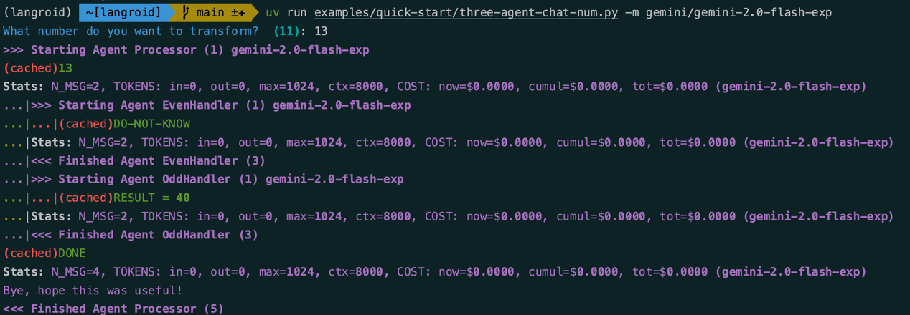

# Three-Agent Collaboration

!!! tip "Script in `langroid-examples`"
        A full working example for the material in this section is
        in the `three-agent-chat-num.py` script in the `langroid-examples` repo:
        [`examples/quick-start/three-agent-chat-num.py`](https://github.com/langroid/langroid-examples/tree/main/examples/quick-start/three-agent-chat-num.py).


Let us set up a simple numbers exercise between 3 agents[^1].
Suppose the current number is $n$. The three agents are: 

- `repeater_agent`, whose job is to simply repeat the number, i.e. return $n$,
- `even_agent`, whose job is to return $n/2$ if $n$ is even, 
  and say `DO-NOT-KNOW` otherwise
- `odd_agent`, whose job is to return $n*3+1$ if $n$ is odd, 
  and say `DO-NOT-KNOW` otherwise.

[^1]: This is a toy example for illustration purposes, and since it's numbers-based,
the token-cost to the LLM API is very low.

As before we first create a common `ChatAgentConfig` to use for all agents:

```py
from langroid.agent.chat_agent import ChatAgentConfig, ChatAgent
from langroid.utils.constants import NO_ANSWER
config = ChatAgentConfig(
    llm = OpenAIGPTConfig(
        chat_model=OpenAIChatModel.GPT4,
    ),
    vecdb = None,
)
```

Next, set up the `repeater_agent`:
```py
repeater_agent = ChatAgent(config)
repeater_task = Task(
    repeater_agent,
    name = "Repeater",
    system_message="""
    Your job is to repeat whatever number you receive.
    """,
    llm_delegate=True, #(1)!
    single_round=False, #(2)!
)
```

1. Setting the `llm_delegate` option to `True` means that the `repeater_task` is
    delegated to the LLM (as opposed to the User), 
    in the sense that the LLM is the one "seeking" a response to the latest 
    number. Specifically, this means that in the `repeater_task.step()` 
    when a sub-task returns `DO-NOT-KNOW`,
    it is _not_ considered a valid response, and the search for a valid response 
    continues to the next sub-task if any.
2. `single_round=False` means that the `repeater_task` should _not_ terminate after 
    a valid response from a responder.
    

Set up the other two agents and tasks:

```py
even_agent = ChatAgent(config)
even_task = Task(
    even_agent,
    name = "EvenHandler",
    system_message=f"""
    You will be given a number. 
    If it is even, divide by 2 and say the result, nothing else.
    If it is odd, say {NO_ANSWER}
    """,
    single_round=True,  # task done after 1 step() with valid response
)

odd_agent = ChatAgent(config)
odd_task = Task(
    odd_agent,
    name = "OddHandler",
    system_message=f"""
    You will be given a number n. 
    If it is odd, return (n*3+1), say nothing else. 
    If it is even, say {NO_ANSWER}
    """,
    single_round=True,  # task done after 1 step() with valid response
)


```

Now add the `even_task` and `odd_task` as subtasks of the `repeater_task`, 
and then run it as before:

```python
repeater_task.add_subtask([even_task, odd_task])
repeater_task.run()
```


Feel free to try the working example script
[`three-agent-chat-num.py`]()
`langroid-examples` repo:
[`examples/quick-start/three-agent-chat-num.py`](https://github.com/langroid/langroid-examples/tree/main/examples/quick-start/three-agent-chat-num.py):

```bash
python3 examples/quick-start/three-agent-chat-num.py
```

Here's a screenshot of what it looks like:



You will notice that the `repeater_agent` did not have to 
bother with specifying who should handle the current number.
In the [next section](three-agent-chat-num-router.md) we add a twist to this game,
so that the `repeater_agent` has to decide who should handle the current number.
