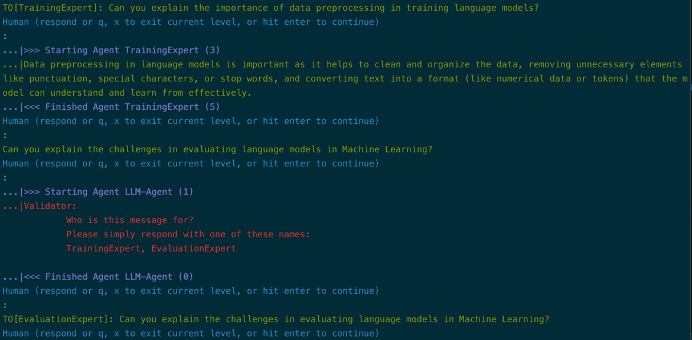

# Three-Agent Collaboration

!!! tip "Script in `langroid-examples`"
        A full working example for the material in this section is
        in the `three-agent-chat.py` script in the `langroid-examples` repo:
        [`examples/quick-start/three-agent-chat.py`](https://github.com/langroid/langroid-examples/tree/main/examples/quick-start/three-agent-chat.py).


Let us extend the 2-agent collaboration example from the previous section,
so that the student delegates to _two_ experts: 

- `TrainingExpert`, an exppert on _training_ Language Models, 
- `EvaluationExpert`, an expert on _evaluating_ Language Models.

While it may seem that going from consulting one expert to consulting two experts
is a small change, it actually introduces a subtlety: 
> The student must clarify who their question is meant for!

Let's see how we can handle this. As before we first create a common 
`ChatAgentConfig` to use for all agents:

```py
from langroid.agent.chat_agent import ChatAgentConfig, ChatAgent
config = ChatAgentConfig(
    llm = OpenAIGPTConfig(
        chat_model=OpenAIChatModel.GPT4,
    ),
    vecdb = None,
)
student_agent = ChatAgent(config)
```

This time, when setting up the student task,
we explicitly instruct the student on how to clarify the
intended recipient of their question:

```py
    student_task = Task(
        student_agent,
        name = "Student",
        system_message="""
        Your task is to write 4 short bullet points about 
        Language Models in the context of Machine Learning (ML),
        especially about training, and evaluating them. 
        However you are a novice to this field, and know nothing about this topic. 
        To collect your bullet points, you will consult 2 people:
        TrainingExpert and EvaluationExpert.
        You will ask ONE question at a time, to ONE of these experts. 
        To clarify who your question is for, you must use 
        "TO[<recipient>]:" at the start of your message, 
        where <recipient> is either TrainingExpert or EvaluationExpert.
        Once you have collected the points you need,
        say DONE, and show me the 4 bullet points. 
        """,
    )
```

Next, we set up the two expert agents and tasks, with the 
`single_round` option set to True as before.

```py
training_expert_agent = ChatAgent(config)
training_expert_task = Task(
    training_expert_agent,
    name = "TrainingExpert",
    system_message="""
    You are an expert on Training Language Models in Machine Learning. 
    You will receive questions on this topic, and you must answer these
    very concisely, in one or two sentences, in a way that is easy for a novice to 
    understand.
    """,
    single_round=True,  # task done after 1 step() with valid response
)

evaluation_expert_agent = ChatAgent(config)
evaluation_expert_task = Task(
    evaluation_expert_agent,
    name = "EvaluationExpert",
    system_message="""
    You are an expert on Evaluating Language Models in Machine Learning. 
    You will receive questions on this topic, and you must answer these
    very concisely, in one or two sentences, in a way that is easy for a novice to 
    understand.
    """,
    single_round=True,  # task done after 1 step() with valid response
)
```

At this point, we might think we could simply add the two expert tasks 
as sub-tasks of the student task, like this:
```python
student_task.add_subtask([training_expert_task, evaluation_expert_task])
```
However, this will _not_ work in general, at least with the current LLM champion
(GPT4):
> Although in the beginning of the conversation, the student agent dutifully
> uses the `TO[<recipient>]` prefix to clarify who their question is for,
> after a few turns, the student agent **starts to omit this prefix** --
> Welcome to LLM Brittleness!

So how do we deal with this? Fortunately, Langroid provides a "special agent"
(no pun intended) called [`RecipientValidator`](/reference/agent/special/recipient_validator_agent)
whose job is to check if a recipient has been specified,
and if not, ask the sending LLM to clarify who it is for. 
There can be two outcomes: the LLM either resends its entire message 
with the proper recipient prefix, or it simply specifies the recipient name.
In the latter case, the RecipientValidator will "agument" the LLM's original 
message with the specified recipient, and adjusts internval variables 
so that  the `Task.step()` sees this augmented message as if it came from the 
LLM ifself.

Let's see how this works in practice. First, we create a RecipientValidator
and the corresponding task:

```py
validator_agent = RecipientValidator(
    RecipientValidatorConfig(
        recipients=["TrainingExpert", "EvaluationExpert"], #(1)!
    )
)
validator_task = Task(validator_agent, single_round=True)
```

1. Here we specify who possible recipients are, in our context

Now we add **three subtasks** to the student task, and then run it as before:
```python
student_task.add_subtask(
    [validator_task, training_expert_task, evaluation_expert_task] #(1)!
)
student_task.run()
```

1. Strictly speaking we actually have _four_ collaborating agents

Feel free to try the working example script 
[`three-agent-chat.py`]()
`langroid-examples` repo:
[`examples/quick-start/three-agent-chat.py`](https://github.com/langroid/langroid-examples/tree/main/examples/quick-start/three-agent-chat.py):

```bash
python3 examples/quick-start/three-agent-chat.py
```

Here's a snippet of how the validator agent detects a missing recipient and then corrects it:



