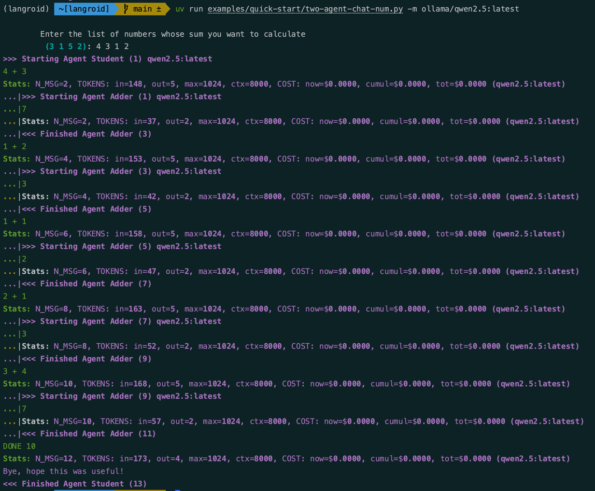

# Two-Agent Collaboration

!!! tip "Script in `langroid-examples`"
    A full working example for the material in this section is
    in the `two-agent-chat-num.py` script in the `langroid-examples` repo:
    [`examples/quick-start/two-agent-chat-num.py`](https://github.com/langroid/langroid-examples/tree/main/examples/quick-start/two-agent-chat-num.py).


To illustrate these ideas, let's look at a toy example[^1] where 
a `Student` agent receives a list of numbers to add.
We set up this agent with an instruction that they do not know how to add,
and they can ask for help adding pairs of numbers.
To add pairs of numbers, we set up an `Adder` agent.

[^1]: Toy numerical examples are perfect to illustrate the ideas without
      incurring too much token cost from LLM API calls.

First define a common `ChatAgentConfig` to use for both agents:
```python
from langroid.agent.chat_agent import ChatAgentConfig, ChatAgent
config = ChatAgentConfig(
    llm = OpenAIGPTConfig(
        chat_model=OpenAIChatModel.GPT4,
    ),
    vecdb = None, #(1)!
)
```

1. We don't need access to external docs so we set `vecdb=None` to avoid 
   the overhead of loading a vector-store.

Next, set up the student agent and the corresponding task:

```py
student_agent = ChatAgent(config)
student_task = Task(
    student_agent,
    name = "Student",
    system_message="""
        You will receive a list of numbers from me (the User),
        and your goal is to calculate their sum.
        However you do not know how to add numbers.
        I can help you add numbers, two at a time, since
        I only know how to add pairs of numbers.
        Send me a pair of numbers to add, one at a time, 
        and I will tell you their sum.
        For each question, simply ask me the sum in math notation, 
        e.g., simply say "1 + 2", etc, and say nothing else.
        Once you have added all the numbers in the list, 
        say DONE and give me the final sum. 
        Start by asking me for the list of numbers.
    """,
    llm_delegate = True, #(1)!
    single_round=False,  # (2)! 
)
```

1. Whenever we "flip roles" and assign the LLM the role of generating questions, 
   we set `llm_delegate=True`. In effect this ensures that the LLM "decides" when
   the task is done.
2. This setting means the task is not a single-round task, i.e. it is _not_ done
   after one `step()` with a valid response.

Next, set up the adder agent and task:

```py
adder_agent = ChatAgent(config)
adder_task = Task(
    adder_agent,
    name = "Adder", #(1)!
    system_message="""
        You are an expert on addition of numbers. 
        When given numbers to add, simply return their sum, say nothing else
        """,
    single_round=True,  # task done after 1 step() with valid response (2)!
)
```

1. The Task name is used when displaying the conversation in the console.
2. We set `single_round=True` to ensure that the expert task is done after 
   one step() with a valid response. 

Finally, we add the `adder_task` as a sub-task of the `student_task`, 
and run the `student_task`:

```py
student_task.add_sub_task(adder_task) #(1)!
student_task.run()
```

1. When adding just one sub-task, we don't need to use a list.


For a full working example, see the 
[`two-agent-chat-num.py`](https://github.com/langroid/langroid-examples/blob/main/examples/quick-start/two-agent-chat-num.py)
script in the `langroid-examples` repo. You can run this using:
```bash
python3 examples/quick-start/two-agent-chat-num.py
```

Here is an example of the conversation that results:



## Logs of multi-agent interactions

!!! note "For advanced users"
    This section is for advanced users who want more visibility into the
    internals of multi-agent interactions.

When running a multi-agent chat, e.g. using `task.run()`, two types of logs
are generated:
- plain-text logs in `logs/<task_name>.log`
- tsv logs in `logs/<task_name>.tsv`

It is important to realize that the logs show _every iteration 
of the loop in `Task.step()`, i.e. every **attempt** at
responding to the current pending message, even those that are not allowed_.
The ones marked with an asterisk (*) are the ones that are considered valid
responses for a given `step()` (which is a "turn" in the conversation).

The plain text logs have color-coding ANSI chars to make them easier to read
by doing `less <log_file>`. The format is (subject to change):
```
(TaskName) Responder SenderEntity (EntityName) (=> Recipient) TOOL Content
```

The structure of the `tsv` logs is similar. A great way to view these is to
install and use the excellent `visidata` (https://www.visidata.org/) tool:
```bash
vd logs/<task_name>.tsv
```

## Next steps
As a next step, look at how to set up a collaboration among three agents
for a simple [numbers game](three-agent-chat-num.md).


