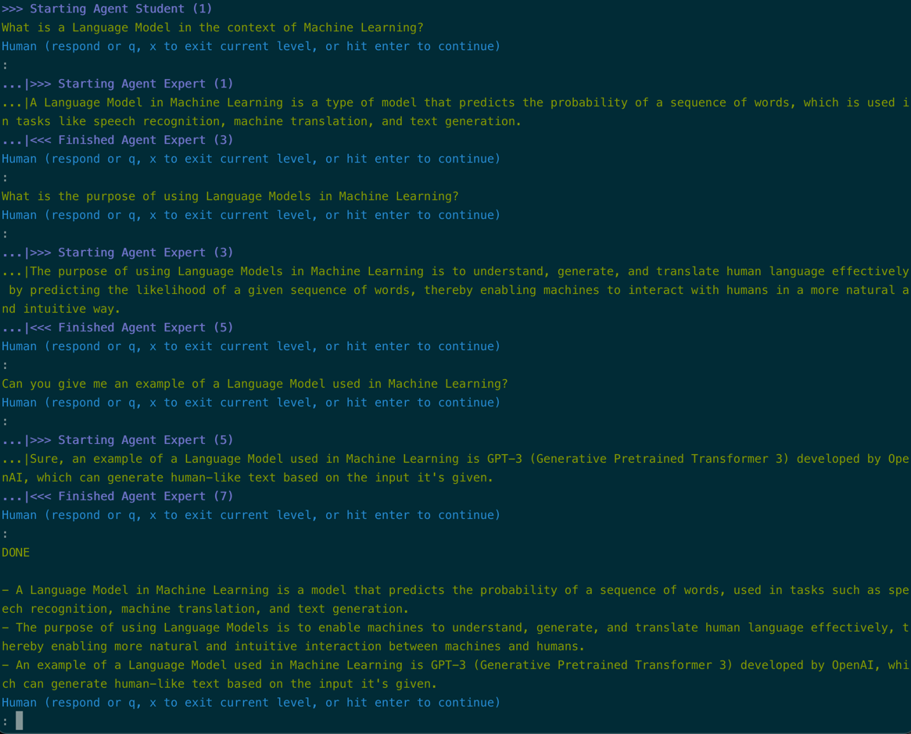

# Two-Agent Collaboration

!!! tip "Script in `langroid-examples`"
        A full working example for the material in this section is
        in the `two-agent-chat.py` script in the `langroid-examples` repo:
        [`examples/quick-start/two-agent-chat.py`](https://github.com/langroid/langroid-examples/tree/main/examples/quick-start/two-agent-chat.py).


To illustrate these ideas, let's look at a toy example where 
we want to set up a "student" agent with the task of collecting 3 key points
about Language Models. The student can consult an "expert" agent to get 
answers to questions. 

First define a common `ChatAgentConfig` to use for both agents:
```python
from langroid.agent.chat_agent import ChatAgentConfig, ChatAgent
config = ChatAgentConfig(
    llm = OpenAIGPTConfig(
        chat_model=OpenAIChatModel.GPT4,
    ),
    vecdb = None, #(1)!
)
```

1. We don't need access to external docs so we set `vecdb=None` to avoid 
   the overhead of loading a vector-store.

Next, set up the student agent and the corresponding task:

```py
student_agent = ChatAgent(config)
student_task = Task(
    student_agent,
    name = "Student",
    system_message="""
    Your task is to write 3 short bullet points about 
    Language Models in the context of Machine Learning. 
    However you are a novice to this field, and know nothing about this topic. 
    To collect your bullet points, you can ask me questions,
    one at a time, which I will answer.
    Once you have what you need, say DONE, and show me the 3 bullet points. 
    """,
)
```

And now set up the expert agent and task:

```py
expert_agent = ChatAgent(config)
expert_task = Task(
    expert_agent,
    name = "Expert", #(1)!
    system_message="""
    You are an expert on Language Models in Machine Learning. 
    You will receive questions on this topic, and you must answer these
    very concisely, in one or two sentences, in a way that is easy for a novice to 
    understand.
    """,
    single_round=True,  # (2)! task done after 1 step() with valid response
)
```

1. The Task name is used when displaying the conversation in the console.
2. We set `single_round=True` to ensure that the expert task is done after 
   one step() with a valid response. 

Finally, we add the expert task as a sub-task of the student task, 
and run the student task:

```py
student_task.add_sub_task(expert_task) #(1)!
student_task.run()
```

1. When adding just one sub-task, we don't need to use a list.


For a full working example, see the 
[`two-agent-chat.py`](https://github.com/langroid/langroid-examples/blob/main/examples/quick-start/two-agent-chat.py)
script in the `langroid-examples` repo. You can run this using:
```bash
python3 examples/quick-start/two-agent-chat.py
```

Here is an example of the conversation that results:



## Logs of multi-agent interactions

!!! note "For advanced users"
        This section is for advanced users who want more visibility into the
        internals of multi-agent interactions.

When running a multi-agent chat, e.g. using `task.run()`, two types of logs
are generated:
- plain-text logs in `logs/<task_name>.log`
- tsv logs in `logs/<task_name>.tsv`

It is important to realize that the logs show _every iteration 
of the loop in `Task.step()`, i.e. every **attempt** at
responding to the current pending message, even those that are not allowed_.
The ones marked with an asterisk (*) are the ones that are considered valid
responses for a given `step()` (which is a "turn" in the conversation).

The plain text logs have color-coding ANSI chars to make them easier to read
by doing `less <log_file>`. The format is (subject to change):
```
(TaskName) Responder SenderEntity (EntityName) (=> Recipient) TOOL Content
```

The structure of the `tsv` logs is similar. A great way to view these is to
install and use the excellent `visidata` (https://www.visidata.org/) tool:
```bash
vd logs/<task_name>.tsv
```

## Next steps
As a next step, look at how to set up a collaboration among three agents
for a simple [numbers game](three-agent-chat-num.md).


