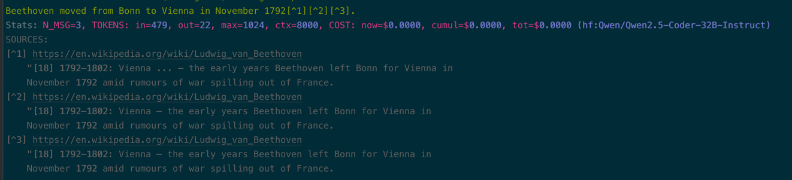
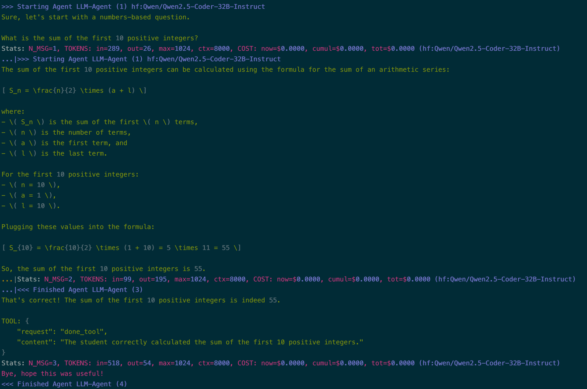

# A quick tour of Langroid

This is a quick tour of some Langroid features. For a more detailed guide,
see the [Getting Started guide](https://langroid.github.io/langroid/quick-start/).
There are many more features besides the ones shown here. To explore langroid more,
see the sections of the main [docs](https://langroid.github.io/langroid/),
and a 
[Colab notebook](https://colab.research.google.com/github/langroid/langroid/blob/main/examples/Langroid_quick_start.ipynb) 
you can try yourself.  


## Chat directly with LLM

Imports:

```python
import langroid as lr
import langroid.language_models as lm
```


Set up the LLM; note how you can specify the chat model -- if omitted, defaults
to OpenAI `GPT4o`. See the guide to using Langroid with 
[local/open LLMs](https://langroid.github.io/langroid/tutorials/local-llm-setup/),
and with [non-OpenAI LLMs](https://langroid.github.io/langroid/tutorials/non-openai-llms/).
    
```python
llm_config = lm.OpenAIGPTConfig( 
   chat_model="gpt-5-mini"
)
llm = lm.OpenAIGPT(llm_config)
```

Chat with bare LLM -- no chat accumulation, i.e. follow-up responses will *not*
be aware of prior conversation history (you need an Agent for that, see below).

```python
llm.chat("1 2 4 7 11 ?")
# ==> answers 16, with some explanation
```

## Agent

Make a [`ChatAgent`][langroid.agent.chat_agent.ChatAgent], 
and chat with it; now accumulates conv history

```python
agent = lr.ChatAgent(lr.ChatAgentConfig(llm=llm_config))
agent.llm_response("Find the next number: 1 2 4 7 11 ?")
# => responds 16
agent.llm_response("and then?)
# => answers 22
```

## Task

Make a [`Task`][langroid.agent.task.Task] and create a chat loop with the user:

```python
task = lr.Task(agent, interactive=True)
task.run()
```

## Tools/Functions/Structured outputs:

Define a [`ToolMessage`][langroid.agent.tool_message.ToolMessage] 
using Pydantic (v1) -- this gets transpiled into system-message instructions
to the LLM, so you never have to deal with writing a JSON schema.
(Besides JSON-based tools, Langroid also supports 
[XML-based tools](https://langroid.github.io/langroid/notes/xml-tools/), which 
are far more reliable when having the LLM return code in a structured output.)


```python
from pydantic import BaseModel

class CityTemperature(BaseModel):
    city: str
    temp: float

class WeatherTool(lr.ToolMessage):
    request: str = "weather_tool" #(1)!
    purpose: str = "To extract <city_temp> info from text" #(2)!

    city_temp: CityTemperature

    # tool handler
    def handle(self) -> CityTemperature:
        return self.city_temp
```

1. When this tool is enabled for an agent, a method named `weather_tool` gets auto-inserted in the agent class, 
   with body being the `handle` method -- this method handles the LLM's generation 
   of this tool.
2. The value of the `purpose` field is used to populate the system message to the LLM,
   along with the Tool's schema derived from its Pydantic-based definition.

Enable the Agent to use the `ToolMessage`, and set a system message describing the 
agent's task:

```python
agent.enable_message(WeatherTool)
agent.config.system_message = """
 Your job is to extract city and temperature info from user input
 and return it using the `weather_tool`.
"""
```

Create specialized task that returns a `CityTemperature` object:

```python
# configure task to terminate after (a) LLM emits a tool, (b) tool is handled by Agent
task_config = lr.TaskConfig(done_sequences=["T,A"])

# create a task that returns a CityTemperature object
task = lr.Task(agent, interactive=False, config=task_config)[CityTemperature]

# run task, with built-in tool-handling loop
data = task.run("It is 45 degrees F in Boston")

assert data.city == "Boston"
assert int(data.temp) == 45
```

## Chat with a document (RAG)

Create a [`DocChatAgent`][langroid.agent.special.doc_chat_agent.DocChatAgent].

```python
doc_agent_config = lr.agent.special.DocChatAgentConfig(llm=llm_config)
doc_agent = lr.agent.special.DocChatAgent(doc_agent_config)
```

Ingest the contents of a web page into the agent 
(this involves chunking, indexing into a vector-database, etc.):

```python
doc_agent.ingest_doc_paths("https://en.wikipedia.org/wiki/Ludwig_van_Beethoven")
```

Ask a question:

```
result = doc_agent.llm_response("When did Beethoven move from Bonn to Vienna?")
```

You should see the streamed response with citations like this:



## Two-agent interaction

Set up a teacher agent:

```python
from langroid.agent.tools.orchestration import DoneTool

teacher = lr.ChatAgent(
    lr.ChatAgentConfig(
        llm=llm_config,
        system_message=f"""
        Ask a numbers-based question, and your student will answer.
        You can then provide feedback or hints to the student to help them
        arrive at the right answer. Once you receive the right answer,
        use the `{DoneTool.name()}` tool to end the session.
        """
    )
)

teacher.enable_message(DoneTool)
teacher_task = lr.Task(teacher, interactive=False)

```

Set up a student agent:

```python
student = lr.ChatAgent(
    lr.ChatAgentConfig(
        llm=llm_config,
        system_message=f"""
        You will receive a numbers-related question. Answer to the best of
        your ability. If your answer is wrong, you will receive feedback or hints,
        and you can revise your answer, and repeat this process until you get 
        the right answer.
        """
    )
)

student_task = lr.Task(student, interactive=False, single_round=True)
```

Make the `student_task` a subtask of the `teacher_task`:

```python
teacher_task.add_sub_task(student_task)
```

Run the teacher task:

```python
teacher_task.run()
```

You should then see this type of interaction:



